# SYSTEM_OVERVIEW.md

## HROS Platform — Authorization, Role Management, User Group, and Permission Domain — System Overview

| Field                   | Value                                                                                                                                                                                                                                                                                                                                                                                                   |
| ----------------------- | ------------------------------------------------------------------------------------------------------------------------------------------------------------------------------------------------------------------------------------------------------------------------------------------------------------------------------------------------------------------------------------------------------- |
| Scope                   | Technical architecture for the Authorization domain (Roles, User Groups, Permissions, Scope, Synchronization) implemented inside the existing `hros-access-service`                                                                                                                                                                                                                                     |
| Primary business source | `authorization-service-prd.md` (v1.0)                                                                                                                                                                                                                                                                                                                                                                   |
| Repository              | `hros-access-service` (existing repository — no new service is created)                                                                                                                                                                                                                                                                                                                                 |
| Audience                | Principal/Senior Backend & Frontend Engineers, DevOps, Security Engineers, Tech Leads                                                                                                                                                                                                                                                                                                                   |
| Precedence              | (1) `authorization-service-prd.md` governs business behavior, (2) this document governs technical design, (3) the existing `hros-access-service` `SYSTEM_ARCHITECTURE.md` governs cross-cutting platform conventions (polyrepo, event envelope, outbox, JWT, Redis session model) that Authorization must reuse rather than reinvent, (4) any conflict is recorded in §43 rather than silently resolved |

> This document does not restate PRD business rules narratively where a table or a direct pointer is clearer, and it does not redefine Authentication. It explains how Authorization is layered into the existing `access-service` NestJS/TypeORM/PostgreSQL/Redis/Kafka stack as a second, clearly bounded internal domain.

---

## Table of Contents

1. [Purpose and Scope](#1-purpose-and-scope)
2. [Source of Truth and Architecture Boundaries](#2-source-of-truth-and-architecture-boundaries)
3. [Technology Stack](#3-technology-stack)
4. [Authorization Domain Overview](#4-authorization-domain-overview)
5. [Permission Catalog Architecture](#5-permission-catalog-architecture)
6. [Role Architecture](#6-role-architecture)
7. [User Group Architecture](#7-user-group-architecture)
8. [Scope Model](#8-scope-model)
9. [Employee Reference Projection](#9-employee-reference-projection)
10. [User Group Matching Engine](#10-user-group-matching-engine)
11. [Materialized Membership Model](#11-materialized-membership-model)
12. [Effective User Role Projection](#12-effective-user-role-projection)
13. [Redis Authorization Model](#13-redis-authorization-model)
14. [L1 Cache Strategy](#14-l1-cache-strategy)
15. [Bootstrap Architecture](#15-bootstrap-architecture)
16. [Frontend Authorization Integration](#16-frontend-authorization-integration)
17. [Business API Authorization Pipeline](#17-business-api-authorization-pipeline)
18. [Role Permission Change Propagation](#18-role-permission-change-propagation)
19. [Employee Attribute Change Propagation](#19-employee-attribute-change-propagation)
20. [User Group Change Propagation](#20-user-group-change-propagation)
21. [Force Sync Architecture](#21-force-sync-architecture)
22. [Scheduled Reconciliation Architecture](#22-scheduled-reconciliation-architecture)
23. [Synchronization Job Model](#23-synchronization-job-model)
24. [Kafka/Event Architecture](#24-kafkaevent-architecture)
25. [Transactional Outbox Integration](#25-transactional-outbox-integration)
26. [Notification Integration](#26-notification-integration)
27. [PostgreSQL Responsibilities](#27-postgresql-responsibilities)
28. [Redis Responsibilities](#28-redis-responsibilities)
29. [Cache Recovery](#29-cache-recovery)
30. [Consistency Model](#30-consistency-model)
31. [Concurrency Handling](#31-concurrency-handling)
32. [Multi-Tenant Isolation](#32-multi-tenant-isolation)
33. [Security](#33-security)
34. [Observability](#34-observability)
35. [NestJS Module Architecture](#35-nestjs-module-architecture)
36. [Deployment Considerations](#36-deployment-considerations)
37. [Failure Scenarios](#37-failure-scenarios)
38. [Scalability](#38-scalability)
39. [Architecture Diagrams](#39-architecture-diagrams)
40. [Sequence Diagrams](#40-sequence-diagrams)
41. [Architecture Decision Records](#41-architecture-decision-records)
42. [Prohibited Designs](#42-prohibited-designs)
43. [Open Technical Decisions](#43-open-technical-decisions)
44. [Risks / Proof-of-Concept Requirements](#44-risks--proof-of-concept-requirements)

---

## 1. Purpose and Scope

This document specifies how the Authorization domain — Permissions, Roles, User Groups, Scope, and Synchronization, as defined in `authorization-service-prd.md` — is implemented **inside the existing `hros-access-service` repository**, as a second internal domain alongside the existing Authentication domain. It does not introduce a new deployable service, a new repository, or a new database.

**In scope:** persistent and runtime data model for Roles/User Groups/Scope; the Permission Catalog and its distribution; membership matching and materialization; effective-role projection; Redis/L1 caching; the bootstrap and business-API authorization pipelines; synchronization (manual and scheduled); Kafka event contracts; outbox integration; notification integration; observability; module architecture; failure and concurrency handling.

**Out of scope (per the PRD and by architectural mandate):** Authentication internals (sessions, credentials, MFA, login) except at integration points; Approval Chain; UI/UX design; a general-purpose policy/rule language; the initial shipped Permission/Role/User Group catalog content; anything not required to implement the PRD's business rules.

---

## 2. Source of Truth and Architecture Boundaries

| Concern                                                                                                                                                         | Owner                                                                                         |
| --------------------------------------------------------------------------------------------------------------------------------------------------------------- | --------------------------------------------------------------------------------------------- |
| Business behavior (what Authorization must do)                                                                                                                  | `authorization-service-prd.md`                                                                |
| Technical design of Authorization (this document)                                                                                                               | `SYSTEM_OVERVIEW.md`                                                                          |
| Cross-cutting `access-service` conventions (polyrepo boundary, shared libraries, JWT/session model, outbox mechanics, event envelope, Redis failure philosophy) | the existing `access-service` `SYSTEM_ARCHITECTURE.md` — reused, not restated                 |
| Employee master data                                                                                                                                            | Directory Service (`hros-directory-service`) — Authorization only ever sees a projection (§9) |

### 2.1 Authentication vs. Authorization — the internal boundary

Both domains live in the same deployable (`hros-access-service`), the same repository, the same NestJS process, and the same PostgreSQL database (as separate table groups, never shared entities). They remain **logically separate domains** with a one-directional, narrow integration surface:

- Authentication produces an authenticated `RequestContext` (`userId`, `tenantCode`, `sessionId`, `securityVersion`) via `@hros/libs-apis` (unchanged, §17.3).
- Authorization **consumes** that context read-only. Authorization never creates or mutates a session, a credential, or any Authentication table.
- Authentication never queries a Role, User Group, or Permission. It has no dependency on the Authorization module.
- The only new coupling point is that `@hros/libs-apis`' guard pipeline gains one additional, optional step (an Authorization Guard) that runs **after** session validation, consuming the same `RequestContext` (§17).

This preserves the domain boundary the PRD and the existing architecture both require, without the operational cost of a second service, a second database, or a second deployment pipeline.

### 2.2 Why Authorization does not become its own service

A separate `hros-authorization-service` was considered and rejected for this iteration: Authorization's runtime path (§17) needs the same `RequestContext` Authentication already builds on every request; splitting it out would reintroduce exactly the kind of synchronous, availability-coupling network call between two independently-deployed repositories that ADR-5/ADR-6 in the Authentication architecture explicitly reject for business services. Housing Authorization inside `access-service` keeps authorization evaluation in-process and fast (§17) while still respecting internal modular boundaries (§35) that would make a future extraction possible if it is ever justified.

---

## 3. Technology Stack

Authorization reuses the existing `access-service` stack without introducing anything new:

| Layer                     | Technology                                                                                          | Authorization-specific note                                                                                                                                |
| ------------------------- | --------------------------------------------------------------------------------------------------- | ---------------------------------------------------------------------------------------------------------------------------------------------------------- |
| Backend runtime/framework | Node.js + TypeScript, NestJS                                                                        | New modules inside the existing modular monolith (§35)                                                                                                     |
| ORM                       | TypeORM                                                                                             | New entities, private to `access-service`, in the same database as Authentication tables (different table group, §27)                                      |
| Durable datastore         | PostgreSQL 18                                                                                       | System of record for Roles, User Groups, Matching Criteria, materialized memberships, effective roles, synchronization jobs, employee reference projection |
| Runtime cache             | Redis (existing cluster)                                                                            | New key namespace (`authz:*`) alongside the existing `auth:*` session namespace (§13); same cluster, same operational model                                |
| Event bus                 | Kafka                                                                                               | New consumed topics (`employee.*` extensions) and new published topics (`authorization.*`), via the existing `@hros/libs-events` (§24)                     |
| Package manager           | pnpm                                                                                                | No change                                                                                                                                                  |
| Shared libraries          | `@hros/libs-core`, `@hros/libs-apis`, `@hros/libs-events`, `@hros/libs-sql`, `@hros/libs-contracts` | `@hros/libs-apis` gains an optional Authorization Guard export (§17.3); `@hros/libs-contracts` gains the canonical Permission Catalog package (§5.6)       |
| Request context           | Node `AsyncLocalStorage`, via `@hros/libs-apis`                                                     | Reused as-is; Authorization reads `tenantCode`/`userId` from the existing context                                                                          |
| Deployment                | Docker, Kubernetes                                                                                  | Authorization ships inside the existing `hros-access-service` image/deployment/HPA; no new namespace, no new pipeline                                      |
| Repository model          | Polyrepo                                                                                            | No new repository; the Permission Catalog is published as a versioned package (§5.6), consistent with existing polyrepo discipline                         |

---

## 4. Authorization Domain Overview

Authorization answers one question on every request: **given an authenticated user, do they hold a Permission, and does it reach the resource in question?** The architecture is built around three deliberately separated concerns that mirror the PRD's own vocabulary:

1. **Definition** — what Permissions exist (static, platform-owned, §5), what a Role grants (tenant-configurable bundle of Permission codes, §6), what a User Group is and who matches it (tenant-configurable population + rule, §7/§10).
2. **Materialization** — derived, durable projections that turn "definition" into "who currently has what, and where" without recomputation on every request: User Group membership (§11) and Effective User Role (§12).
3. **Runtime acceleration** — Redis and an in-process L1 cache that make the hot request path (§17) and the login bootstrap path (§15) O(1)-ish lookups instead of joins or rule evaluation.

The guiding architectural principle, repeated throughout this document, is: **Role changes are cheap (§18) because they touch only a shared, small Role→Permission record; User Group changes can be expensive (§20) because they can touch a large population, so they are made explicitly asynchronous with visible status, never a blocking request.**

---

## 5. Permission Catalog Architecture

### 5.1 Why Permissions are a static, code-owned catalog and not database rows

The PRD is explicit: Permissions are platform-owned, cannot be created/renamed/deleted by a tenant, and are shared verbatim across every tenant. A capability like `employee.view` is not tenant configuration — it is part of what the _application code_ actually understands how to enforce (a specific NestJS guard, a specific frontend route, a specific button). Storing it as a database row would:

- Suggest, incorrectly, that it is tenant-editable data.
- Require a deployment-time migration anyway whenever engineering ships a feature that needs a new Permission, since the enforcement code and the "existence" of the Permission always change together.
- Add a database round trip to a value that is, in practice, compile-time-constant for a given deployed version of `access-service`.

Permissions are therefore defined once, in source control, as a static catalog — the same pattern already used successfully for other fixed platform vocabularies. This is a **Recommended Default** consistent with the PRD's "platform-owned, not tenant data" framing (PRD §4.1, §6 Rule 1), not a business rule the PRD states in technical terms.

### 5.2 Catalog format

A YAML catalog, source-controlled, is the canonical definition:

```yaml
# permission-catalog.yaml
permissions:
  - id: location.view
    module: setting
    resource: location
    action: view
    entry: true # eligible as a navigation entry point

  - id: location.create
    module: setting
    resource: location
    action: create
    requires: [location.view]

  - id: location.update
    module: setting
    resource: location
    action: update
    requires: [location.view]

  - id: location.deactivate
    module: setting
    resource: location
    action: deactivate
    requires: [location.view]

  - id: employee.view
    module: directory
    resource: employee
    action: view
    entry: true

  - id: employee.update
    module: directory
    resource: employee
    action: update
    requires: [employee.view]

  - id: leave.approve
    module: leave
    resource: leave
    action: approve
    requires: [leave.view]
```

Each entry: `id` (the stable `resource.action` identifier, §5.3), `module`/`resource` (grouping metadata for the Role Matrix UI and for navigation, §12), `action`, `requires` (dependency edges, §5.5), `entry` (whether holding this Permission is sufficient, on its own, to expose a top-level navigation entry), and — where a Permission is retired — `deprecated: true` plus a `deprecatedAt`/`removedInVersion` note (§5.7).

### 5.3 `id` as the stable identifier — no database IDs

The Permission `id` string (`location.update`) is the only identifier ever used anywhere: in `role_permissions` rows, in Redis values, in JWT-adjacent authorization payloads, in guard decorators, in the frontend bundle. There is deliberately no numeric/UUID surrogate key for a Permission. This keeps a Permission portable across environments (no "ID 42 means something different in staging"), diffable in code review, and directly greppable across the polyrepo.

### 5.4 Loading into memory

On process bootstrap, `PermissionCatalogModule` parses `permission-catalog.yaml` (bundled into the `access-service` build artifact), validates it (§5.5–§5.7), and holds the parsed catalog as an immutable in-memory structure for the lifetime of the pod — indexed by `id` for O(1) lookup, and grouped by `module`/`resource` for Role Matrix and navigation responses. Because the catalog only changes on a new `access-service` deployment (it is compiled into the artifact, not fetched at runtime), no cache invalidation problem exists for the catalog itself — a new catalog version is simply whatever the currently-running pod's build contains.

### 5.5 Dependency validation (`requires`)

At catalog-load time, `PermissionCatalogModule` validates that every `requires` entry references a real, non-deprecated `id` in the same catalog, and rejects (fails startup) on a dangling or cyclic dependency — this is a build-time/startup-time safety net, not a runtime concern.

At Role-save time (`RoleModule`, §6), the same dependency graph is used to enforce the PRD's business rule (PRD §5.1): granting `location.update` without `location.view` is rejected; removing `location.view` while `location.update` remains granted is rejected. This check is pure in-memory graph traversal against the loaded catalog — no database round trip is required to validate dependencies.

### 5.6 Cross-repository distribution — one canonical source, published once

The frontend (`hros-web`) and any business service that wants to render capability-aware UI or assert a Permission locally must use **the exact same Permission identifiers** `access-service` enforces — a drift here (frontend expects `location.deactivate`, backend only knows `location.deactivate.x`) is a defect class the architecture must close structurally, not by convention.

**Decision:** the Permission Catalog is authored once, inside `hros-access-service` (the service that owns and enforces it), and published as part of `@hros/libs-contracts` (§8.3 of the existing Authentication architecture) as a versioned, generated artifact: a TypeScript `const enum`/union type of every `id`, plus the grouping metadata needed for navigation (`module`, `resource`, `entry`), with no `requires` graph exposed externally (dependency enforcement is an `access-service`-internal concern). `hros-access-service`'s own CI pipeline, on merge, validates the YAML (§5.4–§5.5), generates the `@hros/libs-contracts` types, and that library's own release pipeline publishes them — following the exact publishing discipline already established for `@hros/libs-apis`/`@hros/libs-events` (semver, frozen-lockfile consumers, deprecation windows).

A **MINOR** `@hros/libs-contracts` release adds Permission `id`s (additive, non-breaking for consumers). A **MAJOR** release is required only if an `id` is renamed or removed (§5.7) — new Permissions are the overwhelmingly common case and should never force a coordinated multi-repository release.

### 5.7 Deprecating a Permission safely

A Permission is never deleted outright while it may still appear in a stored `role_permissions` row (deleting it would silently and invisibly strip capability from every Role that held it). The deprecation lifecycle:

1. Mark the catalog entry `deprecated: true` (still valid, still enforceable, still returned in Role Matrix responses but visually flagged) — ships as a `@hros/libs-contracts` MINOR.
2. `RoleModule` prevents a deprecated Permission from being **newly added** to any Role, but does not touch Roles that already hold it.
3. A scheduled report (not a blocking startup check) flags any Role still holding a deprecated Permission, for an administrator/platform-team cleanup pass — this is operational tooling, not a product feature the PRD requires.
4. Only once no `role_permissions` row references the `id` (verified by a query, §27) is the entry actually removed from the catalog — a `@hros/libs-contracts` MAJOR, coordinated the same way any other breaking shared-library change is (existing `SYSTEM_ARCHITECTURE.md` §8.5).

### 5.8 Unknown Permission codes stored in Role configuration

Two independent guards exist against a `role_permissions.permission_code` referencing something the currently-running catalog doesn't recognize (which can only happen via an out-of-band data issue, a rollback, or a bug, since normal writes are always validated against the loaded catalog at write time, §6.4):

- **Write-time:** `RoleModule` rejects any save containing a `permission_code` not present (and not deprecated) in the in-memory catalog — this is the primary defense and should make the read-time case rare.
- **Read-time:** when building the Role→Permission Redis/L1 cache value (§13, §14) or a Role Matrix response, any `permission_code` not found in the loaded catalog is dropped from the _effective_ enforceable set and surfaced as a `staleUnknownPermission` warning in observability (§34) and in the Role's admin detail view, rather than causing the request to fail — an authorization system fails closed on missing grants, never open, so an unrecognized code simply grants nothing rather than crashing the read path.

---

## 6. Role Architecture

### 6.1 Persistent model

```text
roles
-----
id                  UUID PK
tenant_code         VARCHAR(50)      FK -> tenants.tenant_code
name                VARCHAR(150)
description         TEXT NULL
role_type           VARCHAR(20)      SYSTEM | CUSTOM
status              VARCHAR(20)      ACTIVE | INACTIVE
system_role_key     VARCHAR(100) NULL   -- stable key for SYSTEM roles, e.g. 'EMPLOYEE', 'MANAGER', 'BUILT_IN_ADMIN'
version             INTEGER NOT NULL DEFAULT 1     -- optimistic lock + cache-invalidation signal (§18.2)
created_at, updated_at, created_by, updated_by

UNIQUE (tenant_code, name)
UNIQUE (tenant_code, system_role_key) WHERE system_role_key IS NOT NULL
```

```text
role_permissions
-----------------
role_id             UUID FK -> roles.id
permission_code     VARCHAR(150)     -- the Permission Catalog `id`, stored verbatim (§5.3) — no FK to a permissions table
is_protected         BOOLEAN NOT NULL DEFAULT FALSE   -- true only for protected SYSTEM-role capabilities (§6.3)

PRIMARY KEY (role_id, permission_code)
```

`role_permissions` deliberately has no foreign key to any `permissions` table, because none exists (§5.1) — `permission_code` is validated at write time against the in-memory catalog (§5.8), not enforced by the database schema. This is a conscious trade-off: referential integrity for Permissions is an application-layer concern, exactly mirroring how `credentials.algorithm` in the Authentication schema is a validated string, not a foreign key.

`roles.version` increments on every Permission add/remove (and on name/description/status changes that matter for cache correctness). It is the single signal that drives Role-cache invalidation (§18.2) and appears in the Redis `authz:role:*` value (§13) so a stale cache read can be detected without a database round trip on the common path.

### 6.2 System vs. Custom Roles

Every tenant receives the full set of `SYSTEM` roles automatically at tenant provisioning (a new step added to `ProvisioningModule`, alongside the existing built-in-administrator creation, §6.5 of the Authentication architecture) — copied from a platform-defined System Role template (itself part of the deployed catalog/seed data, not a runtime YAML like Permissions, since System Roles carry tenant-scoped rows for rename/extend support, §6.3). `CUSTOM` roles are created directly by tenant administrators via `RoleModule` with no platform template involved.

### 6.3 Protected capabilities

A capability is "protected" for a given System Role when its `role_permissions.is_protected = TRUE` row exists for that Role. `RoleModule`'s update path rejects any request that would remove a `role_permissions` row where `is_protected = TRUE`, returning a business error the API surfaces as the PRD's "clear explanation" (PRD §5.3), and records the rejected attempt for audit (§26) precisely because a rejected attempt is itself security-relevant.

A tenant administrator **extending** a System Role with additional, non-protected capabilities is a normal `role_permissions` insert with `is_protected = FALSE` — no special path. Renaming a System Role's tenant-facing label (PRD §5.3) updates `roles.name` only and never touches `system_role_key`, `role_permissions`, or protection flags — it is modeled as a distinct, narrower mutation with its own audit action type (`role.renamed` vs. `role.permissions-updated`).

### 6.4 Write path validation

Every Role save (create, update permissions, rename) runs, in one flow, inside `RoleModule`: (1) name uniqueness within tenant, (2) every `permission_code` exists and is non-deprecated in the loaded catalog (§5.8), (3) the dependency graph is satisfied for the resulting _entire_ permission set — not just the delta — so a save can never leave a Role in a dependency-inconsistent state, (4) protected-capability removal is rejected (§6.3), (5) if the resulting affected-user estimate exceeds the high-impact threshold (§18.3), the API returns the estimate for confirmation rather than committing (a two-step save, mirroring PRD §5.9's "no change is applied blind"). Only after all checks pass does the transaction (role row + `role_permissions` diff + outbox row, §25) commit.

### 6.5 Copying a Role

Copying (System or Custom) as a starting point (PRD §5.2) creates a brand-new `CUSTOM` row with `role_type = 'CUSTOM'`, a fresh `id`, no `system_role_key`, and a `role_permissions` set cloned from the source **with every `is_protected` flag reset to `FALSE`** — protection is a System Role property, never inherited by a copy (PRD Edge Cases). No lineage reference to the source Role is persisted, consistent with Open Question 8 being unresolved; if lineage is later required it is an additive column, not a redesign.

---

## 7. User Group Architecture

### 7.1 Persistent model

```text
user_groups
------------
id                  UUID PK
tenant_code         VARCHAR(50) FK -> tenants.tenant_code
name                VARCHAR(150)
description         TEXT NULL
status              VARCHAR(20)     ACTIVE | INACTIVE
scope_type          VARCHAR(20)     SELF | DIRECT_REPORTEES | COMPANY | LOCATION | DEPARTMENT | TENANT
scope_ref_kind      VARCHAR(20) NULL   -- 'COMPANY' | 'LOCATION' | 'DEPARTMENT' when scope_type needs a concrete anchor (§8.2)
scope_ref_id        VARCHAR(100) NULL
matching_rule       JSONB NOT NULL   -- restricted rule format (§10.2)
rule_attribute_keys  TEXT[] NOT NULL  -- denormalized list of attribute names the rule reads (§10.3 dependency index)
version             INTEGER NOT NULL DEFAULT 1     -- bumped on ANY change to matching_rule, scope, or status
projection_version  INTEGER NOT NULL DEFAULT 0     -- last version fully applied to memberships/effective roles (§22.2)
created_at, updated_at, created_by, updated_by

UNIQUE (tenant_code, name)
```

```text
user_group_roles
------------------
user_group_id       UUID FK -> user_groups.id
role_id             UUID FK -> roles.id

PRIMARY KEY (user_group_id, role_id)
```

`version` vs. `projection_version` is the dirty-state mechanism used identically by both Force Sync and Scheduled Reconciliation (§16, §21, §22): `version > projection_version` means "this User Group has unapplied configuration," full stop, regardless of _why_ it changed (rule, scope, or Role assignment) or _how_ it will be applied (manual or scheduled).

### 7.2 One Scope per User Group

Per PRD §5.8/Assumption 3, a User Group has exactly one `scope_type` (+ optional `scope_ref_*` anchor) applied uniformly to every Role it assigns — modeled as plain columns on `user_groups`, not a separate table, since there is exactly one Scope per group by current business rule. If Open Question 3 (per-Role scope within one group) is later confirmed, this becomes a `user_group_role_scopes` join table; the current single-column model is deliberately the simpler of the two to avoid speculative generality (YAGNI).

### 7.3 Role assignment mutation

Adding/removing a row in `user_group_roles` bumps `user_groups.version` (it changes what the group's existing matched population receives) exactly like a `matching_rule` or `scope_type` change — from the synchronization model's perspective, "who is in the group" and "what the group grants" are two different write paths that converge on the same dirty-version signal, so §21/§22 need only one mechanism regardless of which sub-change triggered it.

---

## 8. Scope Model

### 8.1 Supported Scope types

Exactly the six concepts the PRD names (§4.6, §5.8), no more:

| `scope_type`       | Meaning                                                                                             | Needs `scope_ref_*`?                                               |
| ------------------ | --------------------------------------------------------------------------------------------------- | ------------------------------------------------------------------ |
| `SELF`             | The employee's own record only                                                                      | No                                                                 |
| `DIRECT_REPORTEES` | The employee's own direct reports (per the Employee Reference projection's `managerEmployeeId`, §9) | No                                                                 |
| `COMPANY`          | A specific company within the tenant                                                                | Yes — `scope_ref_kind='COMPANY'`, `scope_ref_id=<companyId>`       |
| `LOCATION`         | A specific location                                                                                 | Yes — `scope_ref_kind='LOCATION'`, `scope_ref_id=<locationId>`     |
| `DEPARTMENT`       | A specific department                                                                               | Yes — `scope_ref_kind='DEPARTMENT'`, `scope_ref_id=<departmentId>` |
| `TENANT`           | The entire tenant                                                                                   | No                                                                 |

This is a closed enumeration, not an extensible policy language (per explicit PRD/architectural instruction) — adding a seventh Scope concept is a product decision requiring a schema migration and guard-logic change, not a configuration option exposed to any tenant.

### 8.2 Why Scope is data, not logic

`scope_type`/`scope_ref_*` are stored as plain columns, evaluated by a small, fixed `ScopeEvaluator` (one `switch` per `scope_type`, §17.4) rather than as another JSONB rule — Scope concepts are a small, platform-fixed vocabulary (PRD §5.8: "tenant administrators choose among them but do not define new scope concepts"), so a rule-engine-style representation would be strictly more machinery than the requirement calls for.

### 8.3 Union of Scopes for the same Permission

Because `user_effective_roles` (§12) retains one row per `(user, role, source_group)`, an employee holding `employee.view` through two different User Groups with different Scopes simply has two rows with two different `(scope_type, scope_ref_id)` values for the same underlying Role/Permission. The Authorization Guard's scope check (§17.4) evaluates _all_ rows granting the required Permission and allows the request if _any_ row's Scope covers the target — a union, computed at guard-evaluation time over a small in-memory row set, not a separately materialized "combined scope."

---

## 9. Employee Reference Projection

### 9.1 Why a projection, not a cross-service query

`access-service` already maintains a minimal `employee_references` table (existing Authentication schema) for the sole purpose of the one-to-one user↔employee link. Authorization needs a _richer_ slice of employee attributes to evaluate Matching Criteria, but the database-per-service boundary (existing `SYSTEM_ARCHITECTURE.md` §3.3) still applies without exception: `access-service` never queries `hros-directory-service`'s database directly. The existing `employee_references` table is extended with the additional attributes Authorization needs — it remains a **projection**, kept eventually consistent via consumed Kafka events, never a live join into Directory Service.

### 9.2 Extended shape

```text
employee_references   (existing table, extended)
--------------------
employee_id           UUID PK          (unchanged)
tenant_code           VARCHAR(50)      (unchanged)
employee_code         VARCHAR(100)     (unchanged)
status                VARCHAR(30)      (unchanged — employment status)
source_version        VARCHAR(100)     (unchanged — already the idempotency guard, §10.6 of existing architecture)
synchronized_at        TIMESTAMPTZ      (unchanged)

-- new, Authorization-specific attributes:
company_id            VARCHAR(100) NULL
location_id           VARCHAR(100) NULL
department_id         VARCHAR(100) NULL
grade_id              VARCHAR(100) NULL
job_title_id          VARCHAR(100) NULL
manager_employee_id   UUID NULL
reportees_count       INTEGER NOT NULL DEFAULT 0
```

Deliberately **excluded**: salary, bank details, date of birth, home address, personal documents, or any other HR data with no bearing on a Matching Criterion or a Scope evaluation — the projection stays minimal by design, both to respect data-minimization/least-privilege and to avoid `access-service` becoming an unintended second system of record for HR data.

### 9.3 Update path and idempotency

Consumed events (`employee.created`, `employee.updated`, `employee.status-changed`, `employee.reporting-line-changed`, `employee.department-changed`, `employee.location-changed`, §24) each carry the same `source_version` idempotency guard already used by the existing `employee.status-changed` consumer (existing `SYSTEM_ARCHITECTURE.md` §10.6): an incoming event is applied only if its `source_version` is newer than the currently stored value for that `employee_id`; older/duplicate/out-of-order events are discarded as no-ops. This single mechanism — already proven for Authentication's own needs — is reused verbatim for every new attribute, rather than inventing a second idempotency scheme for Authorization.

`reportees_count` is maintained as a **derived counter**, incremented/decremented by `employee.reporting-line-changed` events carrying the old and new `managerEmployeeId` for the affected employee (the event identifies both the employee whose manager changed and, implicitly, the two managers whose counts must adjust) — `access-service` does not recompute the count by scanning all employees on every change.

---

## 10. User Group Matching Engine

### 10.1 What "matching" means here

Matching is the act of evaluating one User Group's `matching_rule` against one employee's current `employee_references` row and producing a boolean. The engine is invoked in two situations only: (a) an individual employee's relevant attributes changed (§19 — evaluate that employee against a narrow set of groups), and (b) a User Group rebuild is running (§20/§21/§22 — evaluate that group's rule against the tenant's employee population). Matching is **never** invoked inline on the request path (§15, §17) — by the time a request is being authorized, membership has already been materialized (§11).

### 10.2 Rule representation

A restricted JSONB structure — no raw SQL, no arbitrary expression evaluation:

```json
{
  "all": [
    { "field": "employmentStatus", "operator": "eq", "value": "ACTIVE" },
    { "field": "reporteesCount", "operator": "gt", "value": 0 }
  ]
}
```

Supported operators (closed set): `eq`, `neq`, `in`, `not_in`, `gt`, `gte`, `lt`, `lte`, `exists`. Supported combinator (closed set, per PRD Assumption 2/Open Question 2): `all` (logical AND) only, for the initial product — an `any` (logical OR) combinator is deliberately not implemented; a tenant need that looks like "OR" is modeled as two separate User Groups instead (PRD Open Question 2), consistent with "no general-purpose policy language."

Supported `field` values are a closed allow-list mapped directly to `employee_references` columns: `employmentStatus`, `companyId`, `locationId`, `departmentId`, `gradeId`, `jobTitleId`, `reporteesCount`, plus `hasReportees` as a convenience boolean derived from `reporteesCount > 0` for readability in the admin UI. Any `field` outside this allow-list, or any `operator` outside the closed set, is rejected at User Group save time with a validation error — this is the structural prevention of arbitrary SQL execution: the rule is never interpolated into a query string; it is walked by application code that maps each clause to a parameterized, statically-known column/operator pair.

### 10.3 Attribute dependency index (avoiding unnecessary re-evaluation)

`user_groups.rule_attribute_keys` (a denormalized `TEXT[]`, kept in sync with `matching_rule` on every save) records exactly which `employee_references` columns a given group's rule reads — e.g., `PEOPLE_MANAGERS` → `['employmentStatus', 'reporteesCount']`. When a single employee's attributes change (§19), `UserGroupMatchingModule` queries only `user_groups WHERE tenant_code = $1 AND rule_attribute_keys && $2` (array-overlap against the set of attribute keys that actually changed for that employee) — a group whose rule never reads `departmentId` is never even loaded, let alone evaluated, when only `departmentId` changed for an unrelated employee. This is the mechanism PRD-adjacent architectural goal #4 ("avoid recalculating from scratch") maps to for the single-employee case.

### 10.4 Evaluation semantics

Evaluation is a pure function: `(rule: MatchingRule, employee: EmployeeReferenceRow) => boolean`, executed in application code (not pushed down as a dynamic SQL WHERE clause per employee) when evaluating one employee against N candidate groups (§19), and executed as a **set-based, parameterized SQL query** translated mechanically from the same closed operator vocabulary when evaluating one group's rule against the full tenant population during a rebuild (§20/§21/§22) — the translation is safe specifically because the operator/field vocabulary is closed and pre-validated at save time (§10.2), so there is no free-form expression ever reaching the query builder.

### 10.5 Extensibility

Adding a new supported `field` (a new employee attribute) requires: (1) the attribute exists on `employee_references` (§9.2), (2) it is added to the allow-list, (3) the SQL-translation layer maps it to a column. Adding a new `operator` requires implementing it once in both the in-memory evaluator (§10.4a) and the SQL translator (§10.4b) — both are small, enumerable surfaces, kept deliberately narrow so this remains a contained change rather than a generic engine that grows unbounded.

---

## 11. Materialized Membership Model

### 11.1 Why materialize at all

Evaluating every User Group's rule against every employee on every authorization check would violate the core architectural goal (avoid recalculating from scratch on the request path) and would not scale to tenants with tens of thousands of employees. Membership is therefore **materialized** — computed once per relevant change and stored — so that "is employee X a member of group Y" is a row lookup, not a rule evaluation, everywhere except the rebuild path itself.

### 11.2 Persistent model

```text
user_group_memberships
------------------------
tenant_code          VARCHAR(50)
user_group_id        UUID FK -> user_groups.id
employee_id          UUID FK -> employee_references.employee_id
matched_at           TIMESTAMPTZ NOT NULL
evaluated_group_version INTEGER NOT NULL   -- the user_groups.version this membership reflects

PRIMARY KEY (user_group_id, employee_id)
```

A row's presence means "currently matched"; membership loss is a row **delete**, not a soft-flag — history of _who was matched when_ is not a membership-table concern (it belongs to the audit trail, §26, at the point a change was applied) — keeping the table's meaning unambiguous: it always reflects the current, applied state as of `evaluated_group_version`.

### 11.3 Update triggers

Two, and only two, paths write to `user_group_memberships`:

1. **Single-employee reevaluation** (§19) — narrow, attribute-driven, touches at most the handful of groups whose `rule_attribute_keys` overlap the changed attributes, for exactly one employee.
2. **Group rebuild** (§21 Force Sync worker, §22 scheduled reconciliation) — set-based, touches one group's full membership diff (adds + removes) against the current employee population, for exactly the groups that are dirty (`version > projection_version`).

Both paths converge on the same idempotent upsert/delete logic (a shared `MembershipReconciler` used by both, §16's explicit "no separate business logic" requirement) and both, on completion, cascade into §12 (effective-role recomputation) for exactly the employees whose membership actually changed — not the group's entire population, only the delta.

---

## 12. Effective User Role Projection

### 12.1 Purpose

`user_effective_roles` is the durable answer to "what Roles, with what Scope, does this user currently hold, and why" — the single table that both (a) Redis rebuild (§13, §29) and (b) any durable audit/debugging query read, so that Redis is never the _only_ place this information exists.

### 12.2 Persistent model

```text
user_effective_roles
----------------------
tenant_code          VARCHAR(50)
user_id              UUID FK -> users.id
role_id              UUID FK -> roles.id
source_group_id      UUID FK -> user_groups.id
scope_type           VARCHAR(20)
scope_ref_id         VARCHAR(100) NULL
group_version        INTEGER NOT NULL   -- user_groups.version this row reflects
role_version         INTEGER NOT NULL   -- roles.version this row reflects (informational; Role content itself is fetched live/cached, §13)
updated_at           TIMESTAMPTZ NOT NULL

PRIMARY KEY (user_id, role_id, source_group_id)
```

One row per _(user, role, the group that granted it)_ — not collapsed to _(user, role)_ — because the same Role can reach the same user through two different groups with two different Scopes (§8.3), and both must independently survive if one of the two groups later stops matching that user.

### 12.3 Recomputation

Recomputed only for the specific `employee_id`/`user_id` whose `user_group_memberships` rows just changed (§11.3): the reconciler diffs "roles implied by current memberships" against "roles currently in `user_effective_roles`" for that one user and applies the minimal insert/delete set — never a full tenant recompute triggered by a single membership change.

### 12.4 What this table is not

It is **not** a flattened `user → permissions` table (§13.4 explains why that shape is explicitly rejected). It stores Role references and Scope, not Permission codes — Permission resolution happens by joining (in-memory, at cache-build time, §13.2) against the small, shared Role→Permission set, so that a Role's Permission change never requires touching `user_effective_roles` at all.

---

## 13. Redis Authorization Model

### 13.1 Two independent, deliberately un-flattened caches

Per the explicit architectural requirement, Authorization Redis state is split into two independently-keyed, independently-invalidated structures, sharing nothing:

```text
authz:user:{tenantCode}:{userId}          -- User -> Effective Roles + Scope (small, per-user)
authz:role:{tenantCode}:{roleId}          -- Role -> Permissions (small, shared by every user holding that Role)
```

### 13.2 `authz:user:{tenant}:{userId}`

A Redis Hash or a single JSON value (implementation detail left to the module, either is acceptable — the contract that matters is the shape):

```json
{
  "version": 4,
  "roles": [
    { "roleId": "role-employee", "scope": { "type": "SELF" } },
    { "roleId": "role-manager", "scope": { "type": "DIRECT_REPORTEES" } }
  ]
}
```

Sourced directly from `user_effective_roles` (§12) for that user — a handful of rows, not a flattened Permission list. `version` here is a monotonically increasing per-user authorization version (incremented on every write to this key), returned to the frontend as `authorizationVersion` in the bootstrap response (§15) so the client can detect that its cached capability set is stale without polling.

TTL: long (e.g., aligned to the maximum plausible session lifetime, a **Recommended Default** — see §43), refreshed on every write; a cache miss is always treated as "rebuild from PostgreSQL" (§29), never as "user has no access."

### 13.3 `authz:role:{tenant}:{roleId}`

```json
{
  "version": 12,
  "permissions": ["employee.view", "employee.update", "leave.approve"]
}
```

Sourced from `role_permissions` for that Role. Because this key is keyed by `roleId`, not by user, it is **shared** by every user who holds that Role — a tenant with 20,000 employees all holding `EMPLOYEE` has exactly one `authz:role:{tenant}:role-employee` key, not 20,000 copies of the same Permission list. `version` mirrors `roles.version` (§6.1) and is the invalidation signal (§18.2): a stale reader can detect `cachedVersion < roles.version` and refresh.

### 13.4 Why not a flattened `authz:user:{tenant}:{userId}` → Permissions cache

A flattened per-user Permission list was explicitly evaluated and rejected as the canonical model: it would require rewriting every affected user's Redis key on every Role Permission change (directly violating architectural goal #5 — "Role permission changes must not require updating thousands of users") and would duplicate the same Permission strings redundantly across every user sharing a Role (violating goal #4). The two-cache split means a Role change is a **single key write** (§18.2), regardless of how many users hold that Role; the request-time cost of unioning two small lookups (§17.2) is negligible compared to the cost of mass cache rewrites on every Role edit — this is a deliberate latency-for-simplicity/scalability trade-off explicitly requested by the architectural goals.

### 13.5 Cache warming, miss behavior, invalidation, consistency

- **Warming:** `authz:user:*` is warmed lazily, on first post-login authorization check or bootstrap call (§15), not eagerly for the whole tenant. `authz:role:*` is warmed lazily on first reference by any user (extremely likely to already be warm given how few distinct Roles exist relative to users), and may optionally be pre-warmed for all `ACTIVE` Roles on pod startup as a cheap optimization (Recommended Default, not required).
- **Miss behavior:** both keys, independently, follow "miss → rebuild from PostgreSQL → populate → serve" (§29) — never "miss → deny," and never "miss → re-evaluate User Group rules" (§29 explicitly forbids that fallback).
- **Invalidation:** `authz:role:{tenant}:{roleId}` is invalidated (overwritten with the new version, not merely deleted — an explicit `SET` avoids a miss-triggered rebuild being needed at all) synchronously, in the same request that commits a Role Permission change (§18.2). `authz:user:{tenant}:{userId}` is invalidated the same way for direct, single-user effective-role changes (§19), and in bulk, per affected user, at the end of a group rebuild (§20/§21/§22) — never as a blanket `FLUSHDB`/pattern-delete across the tenant.
- **Consistency:** both keys are eventually consistent with PostgreSQL for _population_ changes (User Group rebuilds, §30) but **immediately** consistent for Role Permission changes and for single-user Scope/effective-role changes — matching the PRD's differentiated urgency requirement (§9 of the PRD) at the caching layer, not just the job-scheduling layer.
- **Redis failure behavior:** Authorization Redis reads follow the **same fail-closed philosophy** as the existing Authentication Redis model (existing `SYSTEM_ARCHITECTURE.md` §13), but are architecturally **independent** of it — an Authorization Redis miss or outage never touches, and is never conflated with, Authentication's `auth:session:*` keys (different key namespace, same cluster, same failure classification logic reused: "miss" vs. "infrastructure failure" is distinguished exactly as it is for sessions, §29).

---

## 14. L1 Cache Strategy

### 14.1 What goes in L1, and what does not

Only **Role → Permissions** (`authz:role:*`'s content) is a candidate for an in-process L1 cache inside each `access-service` pod. **User → Roles** is deliberately _not_ L1-cached: it is per-user, high-cardinality, and changes (via login, group sync) far more often relative to its read frequency than Role definitions do, so the benefit/complexity ratio is poor. Role definitions, by contrast, change rarely (an administrative action, not a per-request event) and are read on effectively every authorized request — a small, bounded (tens to low hundreds of Roles per tenant, thousands across all tenants at most) in-memory map is a strong fit.

### 14.2 Shape and invalidation

```text
L1 (in-process, per pod):
  Map<`${tenantCode}:${roleId}`, { version: number, permissions: string[] }>
```

Populated lazily on first use per pod (a cold pod has an empty L1 and falls through to Redis, §13.3, which is itself already fast). Invalidated by **version comparison, not push-based eviction**: every read compares the L1 entry's `version` against the `version` embedded in the corresponding Redis value (already being fetched as part of the normal cache-population path when needed, or cheaply checked); a mismatch triggers an L1 refresh from Redis. This avoids needing a pod-to-pod invalidation broadcast (no Redis pub/sub, no additional Kafka topic) — the existing `roles.version`/Redis-`version` mechanism (§6.1, §13.3) already carries the signal L1 needs; L1 just consumes it one layer closer to the request.

### 14.3 Consistency window

Because L1 refresh is comparison-driven rather than push-driven, a pod can briefly serve a stale Role→Permission list between a Role change committing and that pod's next read of the updated version — bounded by how frequently that pod happens to re-check (in practice, on the very next request touching that Role, since the version check is cheap and always performed). For a **security-sensitive revocation** (PRD §5.9/§9), this window must be bounded tightly enough to satisfy the PRD's "prompt" requirement; the recommended implementation always re-validates the `version` on every request (never trusting L1 without the version check) so the actual staleness window is "at most the latency of one Redis round trip," not "however long until some TTL expires" — L1 is a memory-copy optimization of an always-version-checked value, not an independently-TTL'd cache.

### 14.4 Memory constraints

Bounded naturally by the number of distinct `(tenantCode, roleId)` pairs actually touched by traffic on a given pod — in practice, small (low thousands of entries even platform-wide) relative to typical pod memory budgets; no eviction policy beyond an optional LRU cap is required for the initial product (Recommended Default, not a hard requirement).

---

## 15. Bootstrap Architecture

### 15.1 Goal

After a successful login, the frontend needs enough information to render navigation and gate UI actions **without** waiting on any User Group rule evaluation, large PostgreSQL joins, or tenant-wide scans — this is an explicit architectural goal, not a nice-to-have.

### 15.2 Hot path

```text
1 Redis read:  authz:user:{tenant}:{userId}          → Effective Roles + Scope
N small reads: authz:role:{tenant}:{roleId}           → Permissions per Role (served from L1 where warm, §14)
1 in-memory union of Permission strings across all held Roles
1 in-memory mapping from the resulting Permission set → module/resource/entry metadata (from the loaded Permission Catalog, §5.4 — already in process memory, zero I/O)
```

No `user_group_memberships` query. No `matching_rule` evaluation. No `user_effective_roles` PostgreSQL read on the warm path (that table is read only during Redis rebuild, §29).

### 15.3 Response shape

```json
{
  "authorizationVersion": 28,
  "modules": {
    "setting": ["location", "department"],
    "directory": ["employee"]
  },
  "permissions": ["location.view", "location.create", "employee.view", "leave.approve"]
}
```

`authorizationVersion` is the `authz:user:*` version (§13.2) — the frontend can cheaply detect "my cached capability set may be stale" on any subsequent lightweight check without re-fetching the full bootstrap payload every time. `modules` is derived purely from Permission Catalog metadata (`module`/`resource`/`entry`, §5.2) applied to the `permissions` set — no separate database concept of "module" or "navigation permission" exists (§16.2), consistent with the explicit instruction not to create such entities unless clearly necessary.

### 15.4 Scope is intentionally not embedded in the bootstrap payload

Scope is a per-Permission-check concept evaluated against a _specific target resource_ (§17.4) — it has no meaningful flattened representation at the "which nav items are visible" level beyond what `permissions` already conveys, so it is left out of the bootstrap response entirely; the frontend's use of `permissions`/`modules` is UX-only (§16), and any place Scope actually matters is, by definition, an authenticated API call the backend independently authorizes (§17).

---

## 16. Frontend Authorization Integration

### 16.1 What the backend returns, what the frontend owns

The backend (via bootstrap, §15) returns only capability/module/resource identifiers — stable strings from the Permission Catalog. The frontend (`hros-web`) owns everything about _how_ that translates to UI: label text, icon, route path, ordering, visual hierarchy, and the sidebar/route-guard logic that reads `permissions`/`modules` to decide what to render. This mirrors the existing division of labor already established between `access-service` and `hros-web` for Authentication route guards (existing `SYSTEM_ARCHITECTURE.md` §17.2), extended to Authorization: **frontend route/UI protection is a UX convenience only, never authoritative** — restated explicitly here because it is the single most important integration rule for this section.

### 16.2 No separate database entities for module/resource/navigation-permission

`module` and `resource` are Permission Catalog _metadata fields_ (§5.2), not independently persisted entities — there is no `modules` table, no `navigation_permissions` table. Introducing them would duplicate information the catalog already carries and create a second place that can drift out of sync with the actual enforced Permission set.

### 16.3 Staleness handling

If a synchronization event changes what the currently-logged-in user can do (e.g., an administrator revokes a sensitive capability mid-session), the frontend's cached `permissions`/`modules` from bootstrap can go stale. The frontend re-fetches bootstrap (a cheap call, §15.2) on any `403` response from a business API, and may optionally poll or subscribe to a lightweight "your access changed" signal (Open Technical Decision, §43) — but is never required to, because **backend APIs remain independently authorized regardless of what the frontend currently believes** (§17), so a stale frontend cache is a UX inconvenience, never a security gap.

---

## 17. Business API Authorization Pipeline

### 17.1 Placement relative to Authentication

The existing session validation pipeline (existing `SYSTEM_ARCHITECTURE.md` §15, unchanged) runs first and is solely an Authentication concern. Authorization adds one new, optional step **after** step 17 of that pipeline (RequestContext bound) and before business logic:

```text
... existing @hros/libs-apis steps 1-17 (Authentication, unchanged) ...
18. Authorization Guard: resolve required Permission(s) for this route/handler
19. Permission Check: does the user's Effective Role set (Redis, §13) include a Role granting that Permission?
20. Scope Check: does the union of Scopes under which the user holds that Permission cover the target resource?
21. Continue to business logic (permit) or reject 403 (deny)
```

### 17.2 Implementation shape

Handlers declare their required Permission declaratively (a decorator, e.g. `@RequirePermission('location.update')`), read by a NestJS Guard exported from the **existing `@hros/libs-apis` package** (a new, optional export — `AuthorizationGuard` — alongside the existing session guard, so every business-service repository that wants Authorization enforcement installs the same released library version it already depends on for Authentication, with zero new package to add). The guard:

1. Reads `tenantCode`/`userId` from the already-bound `RequestContext` (§20 of the existing architecture — unchanged, reused).
2. Reads `authz:user:{tenant}:{userId}` (§13.2) — one Redis read.
3. For the declared Permission, reads `authz:role:{tenant}:{roleId}` (§13.3, L1-accelerated, §14) for each Role the user holds, until a granting Role is found.
4. If found, evaluates that Role's Scope (from the `authz:user:*` entry) against the request's target-resource identification (§17.4).
5. Permits or returns `403`.

This mirrors, deliberately, how `@hros/libs-apis`' existing session guard never calls `access-service` over the network (existing ADR-6/ADR-12) — the Authorization Guard likewise only ever talks to Redis directly, never to `access-service`'s own internal modules over HTTP, keeping business-service Authorization checks as fast and as decoupled from `access-service`'s own deployment health as session validation already is. (`access-service`'s _own_ HTTP handlers, e.g. `PATCH /locations/:id` inside `hros-access-service` itself, use the identical guard in-process.)

### 17.3 Coupling boundary with `@hros/libs-apis`

The Authorization Guard is published as an **additional, independently usable export** of `@hros/libs-apis`, versioned under the same package (not a new `@hros/libs-authz` package, since it shares the same `RequestContext`/Redis-client conventions and the existing library's release/consumption discipline already fits) — but it is **optional**: a business-service repository that has no Authorization-gated routes need not import or register it, and importing it never implies or requires re-verifying the session (that remains the existing guard's job, always run first). This keeps Authentication's existing guard fully independent and un-modified, satisfying "do not redesign Authentication unless integration is required" — the only integration is "read the context Authentication already produced."

### 17.4 Scope evaluation against a target resource

For a Scope to be evaluated, the handler/guard needs to know _which_ resource the request targets — supplied by the same declarative decorator or a small per-route resolver function (e.g., "the target employee's `companyId`/`managerEmployeeId` comes from the path parameter, resolved via a lightweight lookup"), not by the guard independently querying business data:

```text
SELF               → target.ownerUserId === requester.userId
DIRECT_REPORTEES   → target.employee.managerEmployeeId === requester.employeeId
COMPANY            → target.employee.companyId === scope.scope_ref_id
LOCATION           → target.employee.locationId === scope.scope_ref_id
DEPARTMENT         → target.employee.departmentId === scope.scope_ref_id
TENANT             → always true (already tenant-scoped by RequestContext)
```

`employee.view`-class checks resolve the target employee's attributes from the same Employee Reference projection Authorization already maintains (§9) — no new lookup mechanism, and critically, **no cross-service call to Directory Service on the request path**, preserving the existing "business services never synchronously call another repository for a normal request" discipline.

---

## 18. Role Permission Change Propagation

### 18.1 Expected cost

A Role Permission change (PRD §5.9/§14 of this brief) must be cheap regardless of how many users hold that Role — the architecture guarantees this structurally because of the two-cache split (§13.4): the affected users are never touched at all.

### 18.2 Flow

```text
1. RoleModule validates and commits the role_permissions diff + roles.version increment
   + outbox row, in one PostgreSQL transaction (§25)
2. Same transaction/use-case synchronously overwrites authz:role:{tenant}:{roleId}
   in Redis with the new permissions[] and the new version
3. L1 caches across all pods self-correct on next read via the version-comparison
   check (§14.2) — no broadcast required
4. Outbox relay (existing mechanism, unmodified) publishes authorization.role-updated
```

No `user_effective_roles` row is touched. No `user_group_memberships` row is touched. No per-user Redis key is touched. This is the direct technical realization of "Role permission changes must not require updating thousands of users."

### 18.3 High-impact confirmation before commit

Per PRD §5.9, before the transaction in §18.2 actually commits, `RoleModule` computes (or, for a very large Role population, estimates) the number of users currently holding the Role being changed — a `SELECT COUNT(DISTINCT user_id) FROM user_effective_roles WHERE role_id = $1` (fast: an indexed, already-materialized table, §12) — and returns that count to the caller as a confirmation step if it exceeds the configured high-impact threshold (a **Recommended Default** value, tenant/platform-configurable per PRD Open Question 6, §43), before proceeding to §18.2's actual commit on a second, confirmed request.

### 18.4 Security-sensitive revocation

Because the Redis overwrite in §18.2 step 2 happens synchronously, in the same request/transaction as the PostgreSQL commit, a Role Permission removal is felt on the **very next** Authorization Guard check for any user holding that Role — satisfying the PRD's "prompt, not left to a nightly job" requirement (PRD §9) without needing a separate "urgent" code path for this particular change type, because Role changes are never deferred to asynchronous synchronization in the first place (only User Group population changes are, §20).

---

## 19. Employee Attribute Change Propagation

### 19.1 Expected cost

A single employee's attribute change (e.g., `reporteesCount: 0 → 3`) must normally affect **one** user's authorization state, not the tenant.

### 19.2 Flow

```text
1. Kafka: employee.reporting-line-changed (or the relevant employee.* event) consumed
2. EmployeeReferenceModule applies the update to employee_references,
   guarded by source_version (§9.3) — idempotent, out-of-order-safe
3. UserGroupMatchingModule queries user_groups WHERE rule_attribute_keys && [changed attribute keys]
   (§10.3) — typically a small handful of groups, not the tenant's full group list
4. For each candidate group, evaluate matching_rule against this one employee's
   updated employee_references row (§10.4a, in-memory evaluation)
5. Diff against existing user_group_memberships rows for (employee, candidate groups);
   apply the minimal insert/delete set (§11.3)
6. For each membership actually added/removed, recompute affected
   user_effective_roles rows for that user only (§12.3)
7. Overwrite authz:user:{tenant}:{userId} in Redis for that one user (§13.5)
8. Outbox: authorization.user-membership-changed / authorization.user-access-updated,
   scoped to that one user
```

If step 3 finds zero candidate groups (the changed attribute doesn't appear in any `rule_attribute_keys`), the flow terminates immediately after step 2 — no wasted evaluation.

---

## 20. User Group Change Propagation

### 20.1 Why this can be expensive, and why that's acceptable

Changing a User Group's `matching_rule`, `scope_type`, or Role assignment can change the matching population by thousands of employees in one save — fundamentally different in cost profile from §18 (Role change, always cheap) and §19 (single-employee change, always narrow). The architecture makes this an explicit, visible, asynchronous operation rather than pretending it can be instantaneous.

### 20.2 What "saving" the change actually does

Saving a User Group change is **only**: (1) validate (§10.2 rule syntax, uniqueness, Scope enumeration), (2) show the impact estimate (§20.3) and, if high-impact, require confirmation, (3) on confirm, commit `user_groups` (new `matching_rule`/`scope`/role-assignment rows, `version` incremented) + outbox row, in one transaction. **The employee population is not touched synchronously.** The group is now simply "dirty" (`version > projection_version`), to be picked up by Force Sync (§21) or Scheduled Reconciliation (§22) — both of which share the same rebuild implementation (§16's explicit requirement, realized here).

### 20.3 Impact estimation

Computed via the same set-based SQL evaluation used for a full rebuild (§10.4b), but run in a **read-only, non-committing** mode against the _proposed_ new `matching_rule`/Scope, compared against current `user_group_memberships` for that group, to produce gain/loss counts (PRD §5.9's explicit gain-vs-loss distinction) — the identical query shape as the real rebuild, just diffed against current membership instead of applied, so there is no separately-maintained "estimate" code path to drift from the "actual" rebuild logic.

---

## 21. Force Sync Architecture

### 21.1 Flow

```text
1. Admin clicks "Sync Now" for a Role or User Group with version > projection_version
2. access-service validates: does a job already exist for this exact
   (sourceType, sourceId, sourceVersion) in PENDING/PROCESSING status? (§23.3 idempotency)
   - if yes: return the existing job's id/status (no duplicate job)
   - if no: create a new authorization_sync_jobs row, status=PENDING, triggerType=MANUAL
3. Return 202 Accepted with the job id — the HTTP request never blocks on the rebuild itself
4. A reconciliation worker (§21.2) picks up PENDING jobs
5. Worker: identify affected users (§20.3-style diff, now actually applied)
6. Worker: apply the minimal user_group_memberships diff (§11.3),
   cascading into user_effective_roles (§12.3) and authz:user:* Redis
   overwrites (§13.5), per affected user, in bounded batches
7. On full success: user_groups.projection_version = user_groups.version (§22.2),
   job.status = COMPLETED
8. Outbox: authorization.sync-completed (or authorization.sync-failed) — triggers
   notification (§26)
```

### 21.2 Worker placement

The reconciliation worker is a component of `hros-access-service`'s own deployable — an `AuthorizationSyncModule` background processor, directly analogous to the existing `OutboxModule` relay worker (existing `SYSTEM_ARCHITECTURE.md` §10.8) — polling `authorization_sync_jobs WHERE status = 'PENDING'`, claiming rows (`SELECT ... FOR UPDATE SKIP LOCKED`-style claiming, mirroring the existing outbox relay's own scaling approach, existing §26.1) so multiple `access-service` pod replicas can process different jobs concurrently without double-processing the same job.

### 21.3 Batching within a single job

Large jobs (tens of thousands of affected employees) process in bounded batches (e.g., a configurable batch size, a **Recommended Default**, §43) rather than one giant transaction, so that: (a) a mid-job crash (§31) only loses in-progress-batch work, not the whole job, (b) `authorization_sync_jobs.processed_users` can be updated incrementally for progress visibility (§23), (c) no single database transaction holds locks disproportionate to the change.

---

## 22. Scheduled Reconciliation Architecture

### 22.1 What "scheduled" means here

A recurring process (at minimum daily, per PRD §5.11/Assumption 4) that finds every `user_groups` (and, defensively, `roles`, though Roles are never actually deferred per §18.4) row where `version > projection_version` across **all** tenants, and creates/queues an `authorization_sync_jobs` row with `triggerType = 'SCHEDULED'` for each — reusing the exact same job model and the exact same worker (§21.2) as Force Sync. There is no separate "scheduled sync" execution engine.

### 22.2 Dirty-state detection

```text
user_groups.version = 7
user_groups.projection_version = 6
→ OUT_OF_SYNC → eligible for reconciliation

user_groups.version = 7
user_groups.projection_version = 7
→ fully synchronized → skipped entirely, not reprocessed
```

This single comparison is the entirety of "finding what needs work" — the scheduled process never re-evaluates already-synchronized configurations, satisfying the PRD's "focuses on configurations that actually have pending changes" requirement directly and cheaply (a small, indexed query: `WHERE version <> projection_version`).

### 22.3 Scheduling ownership and distributed-execution safety

The scheduled trigger itself (the thing that runs "once, at the scheduled time, across the whole fleet of `access-service` pods") uses a leader-election/distributed-lock pattern (e.g., a Postgres advisory lock or a Redis-based lock, implementation detail — a **Recommended Default**, §43) so that with N running pods, exactly one pod's scheduler fires the "enqueue reconciliation jobs" step per scheduled cycle, even though every pod runs the same scheduler code. The actual **processing** of the resulting jobs is then naturally distributed across all pods via the existing claim-based worker (§21.2) — only the _enqueue_ step needs single-owner semantics; job _execution_ is already safely concurrent by design.

### 22.4 Retry and missed-schedule recovery

If the scheduled trigger itself is missed (pod restart, deploy, transient failure at the scheduled time), the next scheduled tick simply re-evaluates `version <> projection_version` from scratch — there is no "missed window" to recover, because the dirty-state check is idempotent and time-independent; a Role/User Group that was dirty an hour ago is still dirty now if untouched, and will be picked up by whichever tick runs next. A failed job (§23) is retried by the _next_ scheduled tick automatically re-enqueuing it (since its source is still dirty), in addition to being manually retryable (§21).

### 22.5 Interaction with manual Sync Now

Both paths write into the same `authorization_sync_jobs` table and are subject to the same idempotency check (§21.1 step 2, §23.3): if a `SCHEDULED` job is already `PENDING`/`PROCESSING` for a given `(sourceType, sourceId, sourceVersion)` and an admin clicks Sync Now for the same source, the existing job is returned/reused rather than a second one created — and symmetrically, a scheduled tick that finds a `MANUAL` job already in flight for the same dirty source skips creating a duplicate. `sourceVersion` (the `user_groups.version` the job targets) is part of the uniqueness key precisely so that if the configuration changes _again_ while a job for the old version is still processing, a new job for the new version is correctly created rather than being incorrectly deduplicated against stale work (§31).

---

## 23. Synchronization Job Model

### 23.1 Persistent model

```text
authorization_sync_jobs
-------------------------
id                UUID PK
tenant_code       VARCHAR(50)
source_type       VARCHAR(20)     USER_GROUP | ROLE
source_id         UUID
source_version    INTEGER          -- the version being applied (from roles.version / user_groups.version)
trigger_type      VARCHAR(20)      MANUAL | SCHEDULED | SYSTEM
status            VARCHAR(20)      PENDING | PROCESSING | COMPLETED | FAILED
affected_users    INTEGER NULL     -- estimated at enqueue time, refined during processing
processed_users   INTEGER NOT NULL DEFAULT 0
started_at        TIMESTAMPTZ NULL
completed_at      TIMESTAMPTZ NULL
created_by        UUID NULL        -- the admin user_id for MANUAL; NULL for SCHEDULED/SYSTEM
created_at        TIMESTAMPTZ NOT NULL DEFAULT NOW()
failure_reason    TEXT NULL

UNIQUE (tenant_code, source_type, source_id, source_version) WHERE status IN ('PENDING','PROCESSING')
```

`SYSTEM` as a `trigger_type` is reserved for jobs `access-service` creates on its own initiative outside a human action or the daily schedule (for example, a defensive re-sync after detecting an inconsistency during observability review) — not exercised by any PRD-mandated flow in the initial product, included for forward compatibility rather than speculative use today.

### 23.2 Job creation

Both §21.1 step 2 and §22.1 create rows through the identical `AuthorizationSyncModule` service method — the only difference between a Force Sync job and a Scheduled job is the `trigger_type` value and who calls the creation method (an admin-facing controller vs. the scheduler, §22.3).

### 23.3 Idempotency

The partial unique index (`WHERE status IN ('PENDING','PROCESSING')`) is the database-level backstop, exactly mirroring the existing Authentication `uq_invitations_one_pending_per_user` pattern (existing `SYSTEM_ARCHITECTURE.md` §11.5) — application-level "check before insert" is the common-case path; the partial unique index is what actually guarantees correctness under a race (two nearly-simultaneous Sync Now clicks, or a scheduled tick racing a manual click).

### 23.4 Retry

A `FAILED` job is retried either explicitly (admin clicks "Retry" on a visibly-failed Role/User Group, §37) or implicitly (the next scheduled tick re-enqueues it because the source is still dirty, §22.4) — retry always creates a **new** job row (new `id`, same `source_id`/`source_version` unless the configuration changed again in the interim) rather than mutating the failed row in place, preserving the failed row as an immutable historical fact for audit (§26).

### 23.5 Progress tracking

`processed_users` is updated incrementally as the worker completes each batch (§21.3), giving the admin-facing status view (§5.12 of the PRD) a live "X of Y processed" figure during `PROCESSING`, not just a binary pending/done state.

### 23.6 Concurrent job behavior and restart recovery

Only one job per `(tenant, source_type, source_id, source_version)` can be `PENDING`/`PROCESSING` at a time (§23.3); different sources process fully concurrently across pods (§21.2). If a worker pod crashes mid-job (§31), the job remains `PROCESSING` with a `started_at` timestamp; a watchdog check (part of the same claiming query, or a separate sweep — implementation detail, §43) reclaims jobs `PROCESSING` for longer than a generous timeout back to `PENDING` so another pod's worker picks them up — batched processing (§21.3) means the reclaimed job resumes with only the last partial batch needing redoing, not the whole job, since already-applied `user_group_memberships`/`user_effective_roles` changes are themselves idempotent upserts (safe to reapply).

---

## 24. Kafka/Event Architecture

Authorization reuses the existing event envelope, topic-family strategy, partitioning, and delivery-guarantee model defined in the existing `access-service` architecture (existing §10) without modification — only new topic families and event types are added.

### 24.1 Consumed

`access-service`'s existing `employee.*` consumption (existing §10.3) is extended: `employee.created`, `employee.updated`, `employee.status-changed` (already consumed for Authentication's own suspension/termination handling, §5 of the existing document — Authorization's `EmployeeReferenceModule` subscribes to the same messages for its own attribute needs), plus newly consumed: `employee.reporting-line-changed`, `employee.department-changed`, `employee.location-changed` — all carrying the same `source_version` idempotency field (§9.3), all partitioned by `tenantCode`/`employeeId` per the existing convention (existing §10.4).

### 24.2 Published

New topic family `authorization.*`:

`authorization.role-updated`, `authorization.user-group-updated`, `authorization.user-membership-changed`, `authorization.user-access-updated`, `authorization.sync-requested`, `authorization.sync-completed`, `authorization.sync-failed`.

`authorization.user-membership-changed`/`authorization.user-access-updated` are emitted **per affected user** for a single-employee reevaluation (§19, naturally low-volume — one event per actual change) but are **summarized, not per-user**, for a large group rebuild (§20/§21/§22): the completion of a sync job emits one `authorization.sync-completed` event carrying the job's summary (`affectedUsers`, `sourceType`/`sourceId`), not one event per individual user touched — directly satisfying "do not overproduce per-user events during large synchronization unless there is a clear consumer requirement" (no such requirement currently exists; `hros-notification-service` needs only the job-level summary, §26).

### 24.3 Event contract conventions

Every event uses the existing envelope (`eventId`, `eventType`, `eventVersion`, `tenantCode`, `occurredAt`, `correlationId`, `causationId`, `traceId`, `producer`, `payload`) unchanged; payload shapes are added to `@hros/libs-contracts` alongside the existing Authentication event payloads, versioned additively per the existing policy (existing §8.5/§10.7). All events remain idempotent (consumer-side dedup on `eventId`, unchanged mechanism), tenant-scoped (`tenantCode` always present, partition key unchanged), traceable (`correlationId`/`causationId`/`traceId` unchanged propagation via `AsyncLocalStorage`, existing §20), and safely replayable (Kafka retention window, unchanged policy).

---

## 25. Transactional Outbox Integration

Authorization reuses the **existing** `auth_security_events_outbox` table and the **existing** `OutboxModule` relay worker (existing §10.8, §19 `OutboxModule`) — no second outbox mechanism is introduced. Every Authorization write that must produce a Kafka event (Role save, User Group save, membership/effective-role change, sync job status transition) follows the identical pattern already established for Authentication:

```text
BEGIN
  <Authorization domain-state write(s)>
  INSERT auth_security_events_outbox (pending)
COMMIT
```

with the same relay worker polling, publishing via `@hros/libs-events`, and marking `published`/`failed` — unchanged infrastructure, new callers. `SecurityEventModule` (existing module, §19 of the existing architecture) is extended with Authorization's own sanitization rules (Authorization payloads contain no secrets by construction, but must still exclude anything the audit denylist forbids, e.g., never embedding a raw session token even incidentally) rather than a parallel `AuthorizationEventModule` — reuse over duplication, per the explicit instruction.

---

## 26. Notification Integration

Unchanged from the existing platform rule: `access-service` (for both Authentication and now Authorization) never sends email or push directly; it publishes a Kafka event and `hros-notification-service` owns delivery (existing §9, ADR-17/ADR-18, unmodified).

Authorization-specific triggers, per PRD §5.10:

| Event                                                        | Default channel | Additional channel |
| ------------------------------------------------------------ | --------------- | ------------------ |
| `authorization.sync-completed` (high-impact or long-running) | In-app          | + Email            |
| `authorization.sync-failed`                                  | In-app          | + Email            |
| `authorization.sync-completed` (low-impact, fast)            | In-app          | —                  |

"High-impact"/"long-running" thresholds mirror the same platform/tenant-configurable threshold used for pre-save impact confirmation (§18.3, §20.3) — one threshold concept reused for two related purposes (blocking confirmation before save, notification emphasis after sync) rather than two independently configured values, unless a future need proves they should diverge.

---

## 27. PostgreSQL Responsibilities

PostgreSQL remains the sole durable source of truth for Authorization configuration and derived projections, private to `hros-access-service`'s own database (no schema/table is shared with or queried by another repository, unchanged database-per-service boundary). New table groups, all `tenant_code`-scoped and indexed accordingly (§32):

| Table                            | Purpose                                                |
| -------------------------------- | ------------------------------------------------------ |
| `roles`                          | Role definitions (§6.1)                                |
| `role_permissions`               | Role → Permission code grants (§6.1)                   |
| `user_groups`                    | User Group definitions, rule, scope, versioning (§7.1) |
| `user_group_roles`               | User Group → Role assignment (§7.1)                    |
| `employee_references` (extended) | Employee attribute projection for matching (§9.2)      |
| `user_group_memberships`         | Materialized membership (§11.2)                        |
| `user_effective_roles`           | Materialized effective Role + Scope per user (§12.2)   |
| `authorization_sync_jobs`        | Synchronization job durability/status (§23.1)          |

`roles.version`/`user_groups.version`/`user_groups.projection_version` are the optimistic-concurrency and dirty-state counters (§18, §22.2), following the exact pattern already used for `users.security_version`/`invitations.version`/`authentication_settings.version` in the existing schema (existing §11.7) — `WHERE version = $expected`, zero-row update surfaced as a conflict/retry, no new concurrency-control idiom introduced.

Every use case touching more than one Authorization row (Role save + outbox; membership diff + effective-role diff + outbox) executes in a single PostgreSQL transaction, `READ COMMITTED`, exactly matching the existing transaction-boundary discipline (existing §11.7). Migrations are TypeORM migrations inside `hros-access-service`'s own repository, applied by that repository's own pipeline — never a cross-repository or cross-schema migration (unchanged §24.5 of the existing architecture).

---

## 28. Redis Responsibilities

Redis's role for Authorization is strictly **runtime acceleration of already-durable PostgreSQL state**, never itself the source of truth — the same philosophy already governing Authentication sessions (existing ADR-7), applied to a different key namespace:

| Key pattern                    | Purpose                                                                | Rebuild source               |
| ------------------------------ | ---------------------------------------------------------------------- | ---------------------------- |
| `authz:user:{tenant}:{userId}` | Effective Roles + Scope for fast per-request/​bootstrap lookup (§13.2) | `user_effective_roles` (§12) |
| `authz:role:{tenant}:{roleId}` | Shared Role → Permissions lookup (§13.3)                               | `role_permissions` (§6.1)    |

Both live in the **same Redis cluster** already used for Authentication sessions (no new infrastructure), under a distinct key prefix (`authz:*` vs. `auth:*`) so operational tooling (memory sizing, TTL policy, monitoring) can reason about the two independently even though they share hardware. Sizing is planned incrementally on top of the existing session-key capacity plan (existing §12.7) — Authorization keys are small (a handful of Role references per user; a short Permission list per Role) relative to session hashes.

---

## 29. Cache Recovery

### 29.1 The rule

On any `authz:user:*` or `authz:role:*` miss (isolated key expiry, pod-local cache cold start, full Redis data loss), the recovery path is always:

```text
Redis miss
  → query the relevant durable projection directly
      (user_effective_roles for authz:user:*, role_permissions for authz:role:*)
  → rebuild the Redis key
  → serve the request
```

**Never**: "Redis miss → evaluate every User Group in the tenant" — that fallback is explicitly forbidden by the architectural goals, and is structurally unnecessary because `user_effective_roles` already holds the materialized answer; re-deriving it from User Group rules would defeat the entire purpose of materialization (§11, §12).

### 29.2 Isolated key expiry / single pod cold start

The common case: a single `authz:user:*` rebuild is a single indexed `SELECT ... FROM user_effective_roles WHERE user_id = $1` (cheap, already-indexed by primary key) followed by, at most, a handful of `authz:role:*` lookups/rebuilds for the Roles that user holds — bounded, fast, and indistinguishable in cost from a normal cache-warming read (§13.5).

### 29.3 Broader Redis data loss

If the Authorization portion of Redis is lost wholesale (cluster failure, operator error — the same class of event covered for sessions in the existing architecture's §13), no mass, synchronous rebuild is triggered proactively; keys simply repopulate on-demand via §29.1/§29.2 as traffic naturally touches each `(tenant, user)`/`(tenant, role)` pair again — since every key's rebuild is already cheap and independent, a "thundering herd" concern analogous to the session-recovery login storm (existing §13.2) is far less severe here (no re-authentication is required; Authorization rebuild is a pure read-and-cache-fill against already-durable data, not a credential-verification operation), but the same general mitigations (backoff, per-tenant rate awareness) apply if observability (§34) shows rebuild volume spiking unacceptably.

### 29.4 Independence from Authentication session recovery

This entire recovery model is deliberately **separate** from, and does not alter, the existing Authentication session-loss policy (existing §13, ADR-9: sessions are never reconstructed, forcing re-login). An Authorization Redis miss for an otherwise-still-validly-authenticated user is simply a cache rebuild, not a re-authentication event — the two failure domains must not be conflated in implementation or in on-call runbooks.

---

## 30. Consistency Model

| Change                                                  | Expected propagation                                                                                                                                                                                                   |
| ------------------------------------------------------- | ---------------------------------------------------------------------------------------------------------------------------------------------------------------------------------------------------------------------- |
| Role permission added                                   | Immediate — synchronous Redis overwrite in the same transaction/request (§18.2)                                                                                                                                        |
| Role permission removed (security-sensitive revocation) | Immediate / prompt — same mechanism as above; no deferral path exists for Role changes                                                                                                                                 |
| Employee attribute changed                              | Event-driven, narrow, asynchronous reevaluation of that one employee (§19) — typically applied within the normal Kafka consumption latency, not instant, but scoped to one user and not dependent on any scheduled job |
| Direct single-user effective-role/Scope change          | Immediate at the point the underlying membership/effective-role write completes (§19 step 7)                                                                                                                           |
| User Group matching rule changed                        | Deferred — pending until Sync Now or scheduled reconciliation (§20, §21, §22)                                                                                                                                          |
| User Group scope changed                                | Deferred — same mechanism as a rule change; rebuilds the affected authorization projection (§20)                                                                                                                       |
| User Group Role assignment changed                      | Deferred — same mechanism (§7.3, §20)                                                                                                                                                                                  |
| Permission Catalog version changed                      | Deployment/version-coordinated (§5.6) — not a runtime propagation concern at all; a new `access-service` deployment simply starts enforcing the new catalog                                                            |

**Where eventual consistency is accepted:** any change whose blast radius is a _population_ (a User Group's matching population) rather than a single Role's shared definition or a single employee's own state — this is the PRD's own distinction (PRD §9) realized structurally, not a technical compromise invented independently of the business requirement.

**Where eventual consistency is never accepted:** Role Permission changes (always synchronous) and the specific case of a deliberate, security-sensitive revocation, regardless of which mechanism carries it — if a future business decision routes a sensitive User Group–mediated revocation through an expedited path distinct from routine population recalculation (PRD Open Question 5), that expedited path is modeled as a **higher-priority `authorization_sync_jobs` row** (a `priority` column — a Recommended Default addition, §43) processed ahead of routine `SCHEDULED` jobs by the same worker pool, rather than a bypass of materialization/synchronization altogether — still asynchronous in mechanism, but bounded to a materially tighter SLA than the daily cadence.

---

## 31. Concurrency Handling

| Scenario                                                                                     | Safe behavior                                                                                                                                                                                                                                                                                                                                                                                                                                                                                                                             |
| -------------------------------------------------------------------------------------------- | ----------------------------------------------------------------------------------------------------------------------------------------------------------------------------------------------------------------------------------------------------------------------------------------------------------------------------------------------------------------------------------------------------------------------------------------------------------------------------------------------------------------------------------------- |
| Role updated twice rapidly                                                                   | Optimistic locking on `roles.version` (§27); second writer's `WHERE version = $expected` affects zero rows, surfaced as a conflict for the client to retry against the latest state — no lost update                                                                                                                                                                                                                                                                                                                                      |
| User Group rule updated while synchronization is processing                                  | The in-flight job targets a specific `source_version` (§23.1); the new save increments `user_groups.version` past that job's target, so on completion the job's `projection_version` write only advances to the version it actually applied — the group remains correctly `OUT_OF_SYNC` against the newer version and a new job is created for it (§21.1 step 2, §22.5)                                                                                                                                                                   |
| Employee attributes change while a User Group full rebuild is running                        | The rebuild's set-based query already reflects the employee's state as of query time; if the employee's attributes change again mid-rebuild, the subsequent single-employee reevaluation path (§19) runs independently and its result (being the more recent, narrower write) is not overwritten by the broader job's eventual per-user write, because both paths go through the same idempotent `MembershipReconciler` upsert/delete logic (§11.3) keyed by current rule evaluation, not by "last writer wins on a stale computed value" |
| Manual Sync Now occurs while scheduled reconciliation is already running for the same source | Deduplicated by the partial unique index (§23.3); at most one job per `(source, version)` is ever `PENDING`/`PROCESSING`                                                                                                                                                                                                                                                                                                                                                                                                                  |
| Worker/pod crashes midway through a rebuild                                                  | Batched processing (§21.3) bounds loss to the in-flight batch; watchdog reclaim (§23.6) returns the job to `PENDING` for another pod; all applied writes are idempotent upserts/deletes, safe to reapply                                                                                                                                                                                                                                                                                                                                  |
| Same Kafka employee event delivered multiple times                                           | `source_version` idempotency guard discards the duplicate as a no-op (§9.3, reusing the existing proven mechanism)                                                                                                                                                                                                                                                                                                                                                                                                                        |
| Old employee event arrives after a newer event                                               | Same `source_version` guard rejects the stale event; no regression is applied                                                                                                                                                                                                                                                                                                                                                                                                                                                             |
| Role permission revoked during a large User Group synchronization                            | Independent mechanisms: the Role revocation is synchronous (§18.2) and takes effect immediately for anyone reading `authz:role:*`; the in-flight User Group job continues rebuilding _membership_, which is orthogonal to _what a Role currently grants_ — no interference between the two                                                                                                                                                                                                                                                |
| Redis write fails after PostgreSQL projection update                                         | The PostgreSQL write (the durable fact) already succeeded; the Redis write failure leaves that key stale/missing, which is indistinguishable from a normal cache miss and is corrected by the standard miss-recovery path (§29) on the very next read — the operation retries the Redis write with bounded backoff before falling through to "let the next reader rebuild it," never rolling back the PostgreSQL commit for a cache-layer failure                                                                                         |
| Redis contains stale effective roles                                                         | Version comparison (embedded `version` field in the cached value, §13.2/§13.3) allows a defensive read-time check against the durable `roles.version`/`user_groups.projection_version` where staleness must be provably ruled out (e.g., immediately after an admin's own change, for that admin's own confirmation UI); the general request path trusts Redis without a per-request database round-trip, accepting the bounded staleness window documented in §30 as by-design, not as a defect                                          |

---

## 32. Multi-Tenant Isolation

Every Authorization structure is tenant-scoped, with no exception:

- **PostgreSQL:** every new table carries `tenant_code` (directly, as on `roles`/`user_groups`/`authorization_sync_jobs`, or transitively via a tenant-scoped foreign key); every query issued by Authorization modules goes through the same TypeORM repository wrapper already enforcing automatic `tenantCode` scoping from the active `RequestContext` (existing §11.1, unchanged, extended to Authorization's own entities).
- **Redis:** `authz:user:{tenantCode}:{userId}` and `authz:role:{tenantCode}:{roleId}` always embed `tenantCode` in the key itself — no key is ever addressable without it, and hash-tagging (`{tenantCode:...}`) follows the same convention as the existing session keys (existing §12.6) so multi-key operations for one tenant's data never spill into another tenant's Redis Cluster slot planning.
- **Synchronization jobs:** `authorization_sync_jobs.tenant_code` scopes every job; the scheduled reconciliation trigger (§22.1) explicitly iterates per tenant and one tenant's job volume/failure never blocks or delays another tenant's jobs, since jobs are claimed and processed independently (§21.2) with no cross-tenant ordering dependency.
- **Audit events:** every audit record (§26 of the Authentication document's pattern, extended here) carries `tenantCode`; queries for audit history are always tenant-scoped.
- **The one deliberate exception:** the Permission Catalog (§5) is platform-global by design — its `id`s, `module`/`resource` metadata, and dependency graph are identical for every tenant. Only the _selection_ of which Permissions a given Role holds is tenant-specific configuration.

---

## 33. Security

- **Least privilege by construction:** the Scope model (§8) ensures a granted Permission never implies more reach than the Scope explicitly states — there is no code path where holding a Permission through a narrowly-scoped User Group silently grants tenant-wide reach.
- **Protected capabilities are enforced server-side only** (§6.3) — never trust a client-supplied claim about which capabilities are protected; the check is always against the current `role_permissions.is_protected` flag in PostgreSQL (or the Redis/L1 mirror of it) at write time.
- **No arbitrary code/SQL execution from tenant-authored configuration:** the Matching Criteria format's closed field/operator vocabulary (§10.2) is the structural prevention — rule JSON is never interpolated into a query string; it is validated against an allow-list and translated through a fixed, enumerable mapping.
- **Frontend authorization signals are never trusted for enforcement** (§16.1) — every business API independently re-checks Permission and Scope via the Authorization Guard (§17); a compromised or stale frontend cannot itself grant access.
- **Audit-payload denylist reuse:** Authorization audit/event payloads flow through the same sanitization utility already governing Authentication payloads (existing §21, `@hros/libs-core`), so no Authorization event can accidentally leak a session token, password, or other Authentication secret it happens to have incidental access to in shared process memory.
- **Tenant isolation is treated as a security control, not just a data-modeling convenience** (§32) — every new query path is reviewed against the same tenant-scoping wrapper Authentication already relies on.

---

## 34. Observability

| Category                                  | Signals                                                                                                                                                                                                    |
| ----------------------------------------- | ---------------------------------------------------------------------------------------------------------------------------------------------------------------------------------------------------------- |
| Bootstrap latency                         | p50/p95/p99 for the `/auth/bootstrap`-equivalent endpoint's Authorization portion specifically (Redis reads + union + catalog lookup, §15)                                                                 |
| Authorization Guard latency               | p50/p95/p99 per business-service repository consuming the guard, mirroring how the existing `@hros/libs-apis` session-pipeline latency is already tracked per consumer (existing §27)                      |
| Redis hit/miss                            | Separately for `authz:user:*` and `authz:role:*`, distinct from the existing `auth:session:*` hit/miss metrics                                                                                             |
| User Group evaluation latency             | Per-rebuild-job duration, and per-single-employee-reevaluation duration (§19), tracked separately since their cost profiles differ by orders of magnitude                                                  |
| Synchronization queue/backlog             | Count and max-age of `PENDING` `authorization_sync_jobs`, mirroring the existing outbox-backlog observability pattern (existing §10.9)                                                                     |
| Sync duration                             | Wall-clock time from `PROCESSING` start to `COMPLETED`/`FAILED`, per job, alertable against an SLA appropriate to the affected-user count                                                                  |
| Affected-user count                       | Recorded per job (`affected_users`) for both audit and capacity-planning purposes                                                                                                                          |
| Failure/retry count                       | Per source type (`ROLE` vs. `USER_GROUP`), surfaced distinctly since a Role sync failure should essentially never happen (Role changes are synchronous, §18) and would itself be an anomaly worth flagging |
| Stale projection count                    | Count of `user_groups`/`roles` currently `OUT_OF_SYNC` (`version <> projection_version`) at any point in time, platform-wide and per-tenant, as a health/backlog indicator independent of any specific job |
| Group membership rebuild rate             | Employees processed per second during an active rebuild, for capacity planning against the largest supported tenant                                                                                        |
| Unknown/stale Permission code occurrences | Count of `staleUnknownPermission` warnings (§5.8), which should be near-zero in steady state and is a signal of a catalog/deployment mismatch if it rises                                                  |

**Cardinality discipline:** individual Permission codes, tenant codes, and user identifiers are not used as metric label values (unbounded/high-cardinality); they appear only in structured log lines and audit records (queryable, not aggregated as Prometheus-style label dimensions), consistent with the existing platform's general observability discipline (existing §27's "no secret in a log line or metric label" rule, extended here to "no unbounded-cardinality business identifier in a metric label").

---

## 35. NestJS Module Architecture

New modules inside `hros-access-service`'s existing modular monolith (alongside, not replacing, the existing Authentication modules from the existing architecture's §19):

| Module                          | Responsibility                                                                                                                                                                |
| ------------------------------- | ----------------------------------------------------------------------------------------------------------------------------------------------------------------------------- |
| `PermissionCatalogModule`       | Loads and validates the static catalog (§5.4); exposes in-memory lookup, dependency-graph validation, and module/resource metadata                                            |
| `RoleModule`                    | `roles`/`role_permissions` aggregate: CRUD, protected-capability enforcement, dependency validation, high-impact estimation (§6, §18.3)                                       |
| `UserGroupModule`               | `user_groups`/`user_group_roles` aggregate: CRUD, Scope configuration, Role assignment, matching-rule validation (§7)                                                         |
| `EmployeeReferenceModule`       | Consumes `employee.*` events, maintains the extended `employee_references` projection (§9)                                                                                    |
| `UserGroupMatchingModule`       | Matching-rule evaluation (single-employee and set-based), attribute-dependency indexing (§10)                                                                                 |
| `AuthorizationProjectionModule` | Owns `user_group_memberships` and `user_effective_roles` materialization/reconciliation (`MembershipReconciler`, §11, §12)                                                    |
| `AuthorizationCacheModule`      | Owns all `authz:*` Redis reads/writes and the L1 cache (§13, §14, §29)                                                                                                        |
| `AuthorizationSyncModule`       | Owns `authorization_sync_jobs`, the Force Sync API, the scheduled-reconciliation trigger, and the reconciliation worker (§21, §22, §23)                                       |
| `AuthorizationGuardModule`      | Wires the `@hros/libs-apis` Authorization Guard (§17) for `access-service`'s own authenticated endpoints, exactly as other business services wire it via the released package |

Reused, unmodified: `KafkaModule` (extended with new consumed/published topics, §24), `OutboxModule` (§25, no changes), `SecurityEventModule` (extended with Authorization sanitization rules, §25), `ObservabilityModule`, `HealthModule`.

### 35.1 Dependency direction

```text
RoleModule
        ↓
AuthorizationProjectionModule
        ↓
AuthorizationCacheModule

UserGroupModule
        ↓
UserGroupMatchingModule
        ↓
AuthorizationProjectionModule
        ↓
AuthorizationCacheModule

EmployeeReferenceModule
        ↓
UserGroupMatchingModule

AuthorizationSyncModule
        ↓ (orchestrates, does not own)
UserGroupMatchingModule, AuthorizationProjectionModule, AuthorizationCacheModule

PermissionCatalogModule
        ↑ (read-only, no downstream dependency)
RoleModule, AuthorizationCacheModule, AuthorizationGuardModule
```

`PermissionCatalogModule` has no outbound dependency on any other Authorization module — it is a pure, self-contained, in-memory lookup service, consumed by everything else. `AuthorizationCacheModule` never depends back on `AuthorizationProjectionModule`'s callers (`RoleModule`/`UserGroupModule`) — it is invoked by them, not the reverse — preventing a circular dependency between "definition" and "runtime acceleration." `AuthorizationSyncModule` orchestrates the other modules' public application-service interfaces (never their repositories directly, per the existing cross-module prohibition, existing §19.1/§19.3) and is the only module aware of the job lifecycle.

### 35.2 Prohibited dependencies (extending the existing list)

- No Authorization module imports an Authentication module's repository/entity directly, and vice versa — only public application-service interfaces, if any cross-domain call is ever needed (none is required by this design, §2.1).
- `AuthorizationGuardModule`/the `@hros/libs-apis` guard export never calls into `AuthenticationModule`/`SessionModule` — it only reads the already-bound `RequestContext` (§17.3).
- No module other than `KafkaModule`'s existing wrapper publishes to Kafka except through `SecurityEventModule`/`OutboxModule` (unchanged rule, §25).
- `PermissionCatalogModule` never reads from PostgreSQL or Redis — it is deployment-artifact-driven only (§5.4).

---

## 36. Deployment Considerations

Authorization ships **inside the existing `hros-access-service` deployable** — same Docker image, same Kubernetes Deployment, same HPA, same namespace, same CI/CD pipeline as Authentication (existing §24, unmodified). No new repository, no new pipeline, no new Kubernetes namespace.

- **Migrations:** new Authorization tables are added via `hros-access-service`'s own existing TypeORM migration process (existing §24.5), applied by the same `Job`/init-container as Authentication's migrations — a single migration pipeline for the whole service, ordered so Authorization's tables (which have no foreign key into any Authentication-owned table other than `users`/`tenants`, already present) can be added independently of any Authentication schema change.
- **Startup:** `PermissionCatalogModule`'s catalog load/validation (§5.4) becomes an additional startup-probe gate (existing §24.2 "Startup probes: gate traffic until migrations/JWKS bootstrap complete on cold start" — extended to include "and the Permission Catalog is loaded and validated") — a pod that fails catalog validation never becomes ready.
- **Background worker:** the reconciliation worker (§21.2) runs as an in-process component of the same `access-service` pods (like the existing outbox relay), not a separate Deployment — horizontal scaling of `access-service` naturally scales reconciliation worker capacity, using the same claim-based concurrency-safety mechanism.
- **Scheduled trigger:** the daily reconciliation trigger (§22.3) requires a leader/lock mechanism precisely because it now runs across the same horizontally-scaled pod fleet as everything else in `access-service` — this is a new operational concern relative to Authentication (which had no scheduled, fleet-wide trigger before), called out explicitly as a delta from the existing deployment model.
- **Resource sizing:** Authorization's incremental CPU/memory footprint (catalog in memory, L1 cache, additional Redis/PostgreSQL connections) is folded into `access-service`'s existing resource requests/limits tuning (existing §24.4) rather than planned as a separate budget, since it shares the same pods.

---

## 37. Failure Scenarios

| Scenario                                                                 | User-Visible Behavior                                                                                                                                                                                                      | Retry/Recovery                                                           | Consistency Impact                                                                                                                         |
| ------------------------------------------------------------------------ | -------------------------------------------------------------------------------------------------------------------------------------------------------------------------------------------------------------------------- | ------------------------------------------------------------------------ | ------------------------------------------------------------------------------------------------------------------------------------------ |
| `authz:user:*` Redis miss                                                | Transparent — one extra PostgreSQL read on that request, then served normally (§29.2)                                                                                                                                      | Self-healing on next read                                                | None — durable data intact                                                                                                                 |
| `authz:role:*` Redis miss                                                | Same as above, plus an L1 refresh on the same pod                                                                                                                                                                          | Self-healing                                                             | None                                                                                                                                       |
| Redis (Authorization namespace) unavailable                              | `503`-class failure on requests needing an Authorization decision (mirrors the existing session-store-unavailable classification, but flagged as `AUTHZ_STORE_UNAVAILABLE` distinct from `AUTH_SESSION_STORE_UNAVAILABLE`) | Client backoff/retry; staged recovery mirrors existing §13.2 mitigations | Fails closed — never grants on uncertain Redis state, consistent with the existing platform-wide "fail closed" principle (existing ADR-22) |
| PostgreSQL unavailable                                                   | Role/User Group administration fails; already-cached Authorization decisions for existing users may continue to be served from Redis until it, too, needs a miss-recovery read                                             | Backoff retry; DB failover per existing platform DR posture              | No writes lost; reads degrade gracefully as long as Redis remains warm                                                                     |
| Kafka unavailable (Authorization topics)                                 | No immediate impact on Authorization checks (outbox buffers, §25); employee attribute changes queue in the outbox/consumer lag rather than being lost                                                                      | Outbox relay/consumer resumes on Kafka recovery                          | Employee reference projection updates delay; membership stays on the last-known-good attribute snapshot until caught up                    |
| `authorization_sync_jobs` worker pod crash mid-rebuild                   | In-flight job appears `PROCESSING` until watchdog reclaim (§23.6); administrator sees "Processing" longer than expected, not a false "Completed"                                                                           | Reclaimed by another pod's worker after timeout                          | Batched idempotent writes bound the loss to the last partial batch                                                                         |
| Scheduled reconciliation trigger fails to fire (leader-election failure) | No user-visible immediate impact; pending changes simply wait for the next successful tick                                                                                                                                 | Next tick re-evaluates dirty state from scratch (§22.4)                  | Bounded by the reconciliation cadence (daily default) — not indefinite, since the dirty-state check itself never expires                   |
| Permission Catalog fails validation on a new deployment                  | New pods fail their startup probe and never receive traffic; old pods (still running the prior, valid catalog) continue serving                                                                                            | Standard Kubernetes rollout rollback                                     | No live-traffic impact if rollout gating works correctly; a bad catalog never reaches production traffic                                   |
| Employee event stream falls behind (large Kafka backlog)                 | User Group membership for affected employees lags reality until backlog drains; existing Roles/Permissions for already-materialized users are unaffected                                                                   | Standard consumer-lag recovery; no data loss, ordering preserved         | Explicitly the accepted eventual-consistency case per §30                                                                                  |

---

## 38. Scalability

- **Role reads dominate the request path** and are the cheapest possible shape to scale: a shared, small, L1-accelerated Redis value (§13.3, §14) — read volume scales with request volume, not with tenant employee count, because the same `authz:role:*` key serves every user holding that Role.
- **User reads** scale linearly with active users, but each is a single small Redis read (§13.2) — no join, no per-request rule evaluation — so this scales the same way the existing session-validation Redis load already does (existing §26.1's "Redis Cluster shards session keys by hash slot" applies identically to the `authz:*` namespace).
- **Group rebuilds** are the one genuinely large-population operation, and are explicitly kept off the request path (§20) and off any latency-sensitive budget — their cost scales with a tenant's group-change frequency and population size, isolated per tenant via the same partitioning/hash-tagging discipline already used elsewhere (existing §26.1 "tenant hotspots" mitigation, extended to Authorization sync jobs), and horizontally parallelizable across `access-service` pod replicas (§21.2).
- **Employee attribute change volume** scales with normal HR activity (hires, transfers, reporting-line changes) — bounded, event-driven, and, per employee, cheap (§19) regardless of tenant size, because the attribute-dependency index (§10.3) keeps each single-employee reevaluation narrow.
- **Large tenants (tens of thousands of employees):** the materialized-membership/effective-role model (§11, §12) is precisely the mechanism that keeps this domain's scalability independent of tenant size at read time — the _cost_ of a large tenant shows up only in rebuild duration (§21.3 batching) and impact-estimate query cost (§20.3, a single indexed aggregate query), never in the steady-state authorization-check hot path.

---

## 39. Architecture Diagrams

### 39.1 Authorization System Context Inside `access-service`

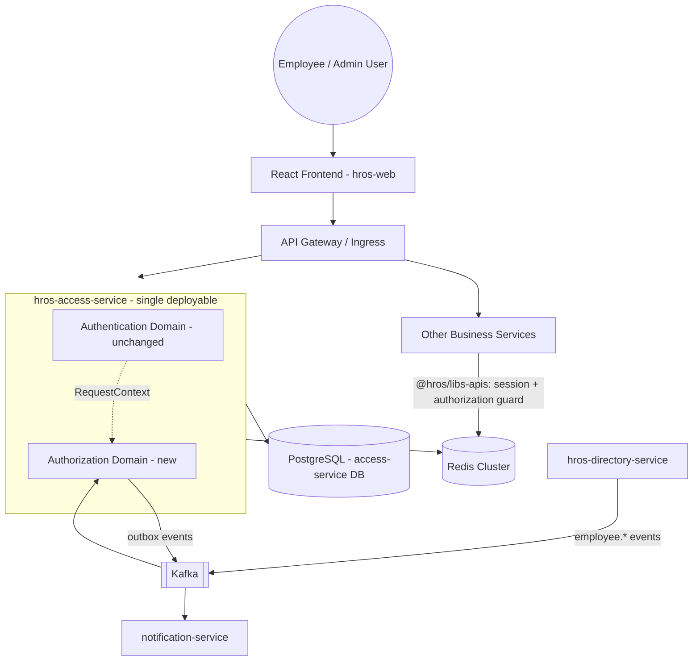

### 39.2 Authorization Internal Component Architecture

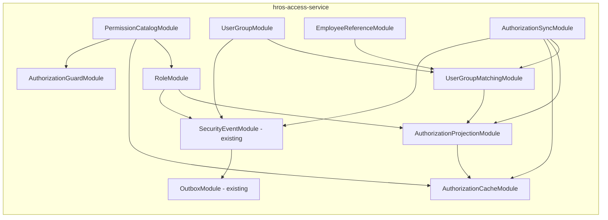

### 39.3 Authorization Data Ownership

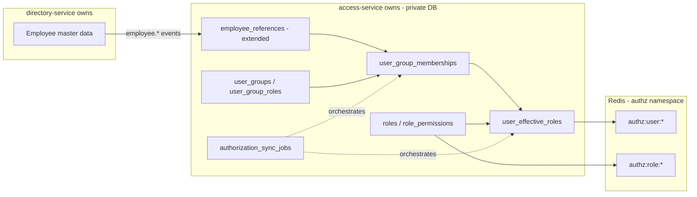

### 39.4 Employee Event → Group Matching → Effective Role Projection

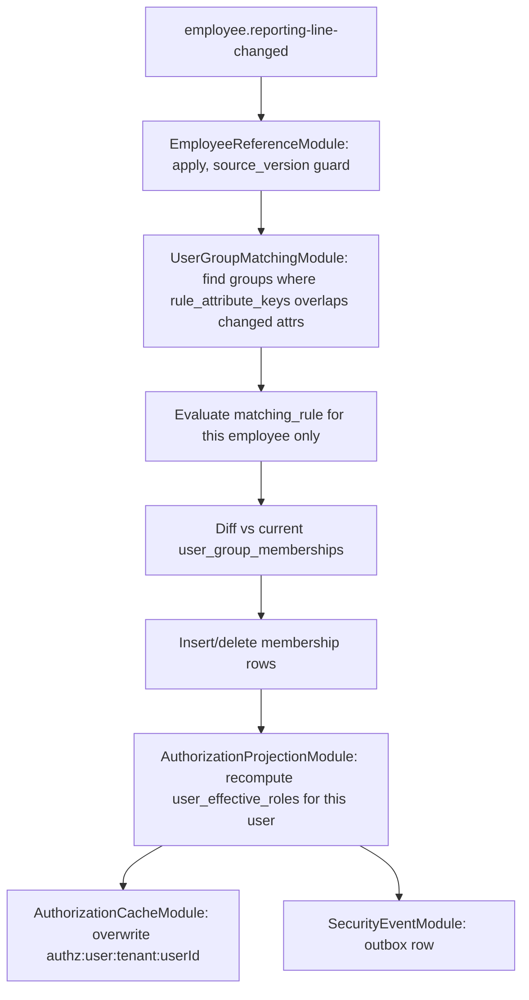

### 39.5 Login / Bootstrap Flow

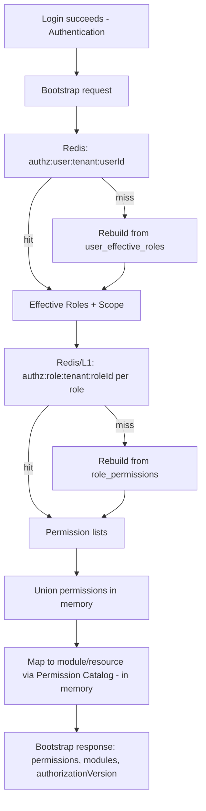

### 39.6 Business API Authorization Flow

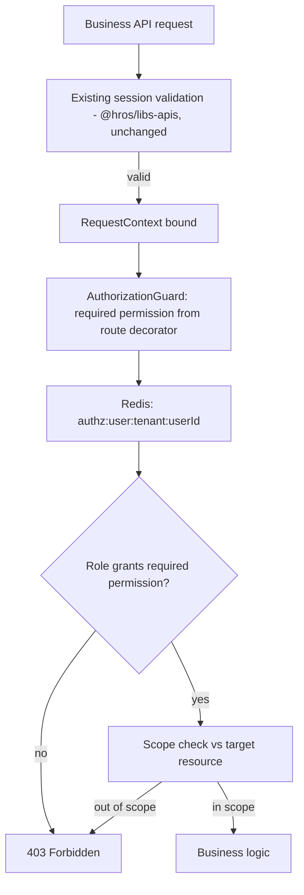

### 39.7 Role Permission Update

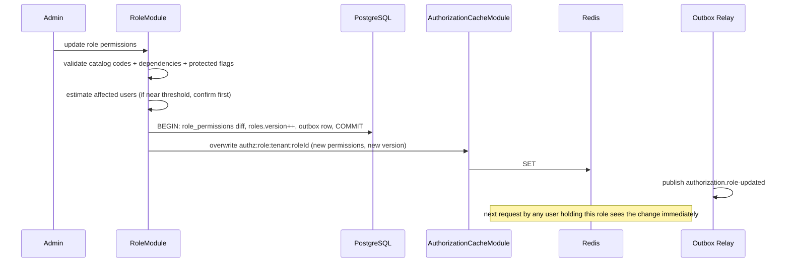

### 39.8 Employee Becoming a Manager

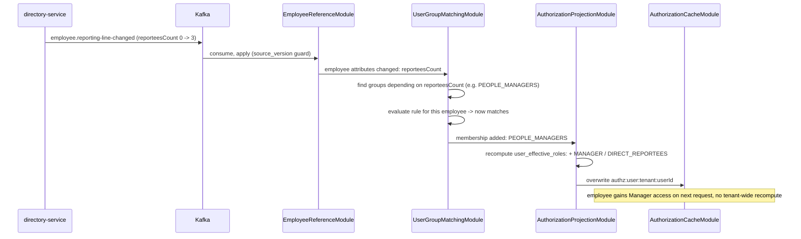

### 39.9 User Group Rule Change + Sync Now

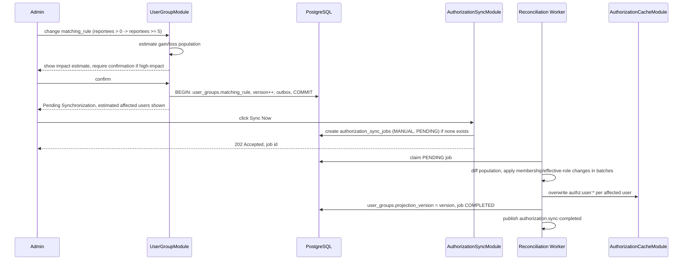

### 39.10 Scheduled Reconciliation

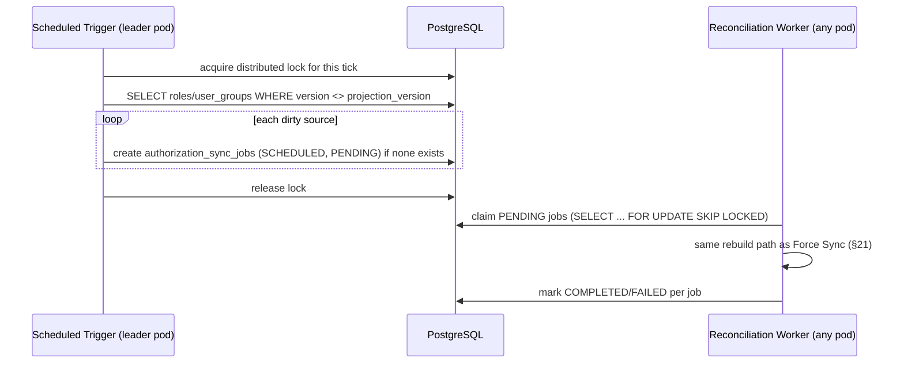

### 39.11 Redis Cache Miss Recovery

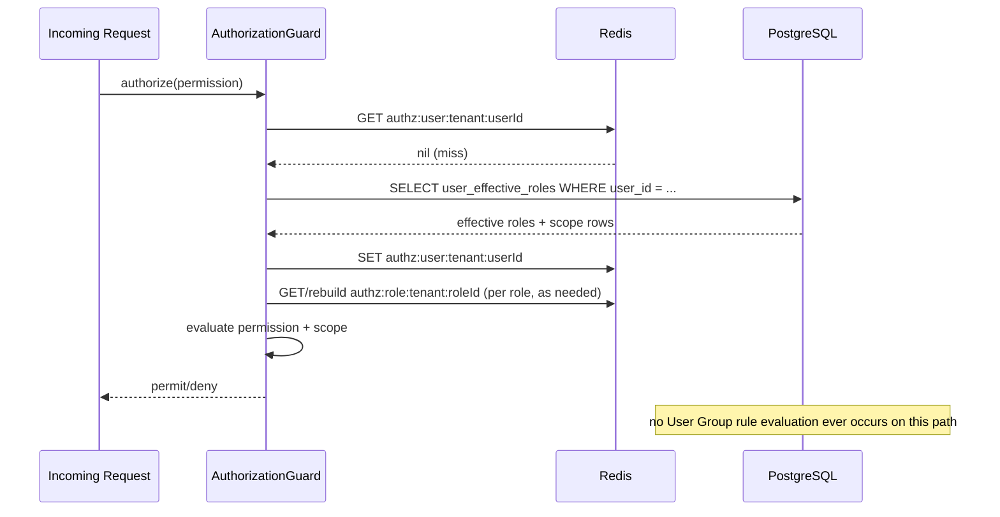

### 39.12 Authorization Synchronization Job Lifecycle

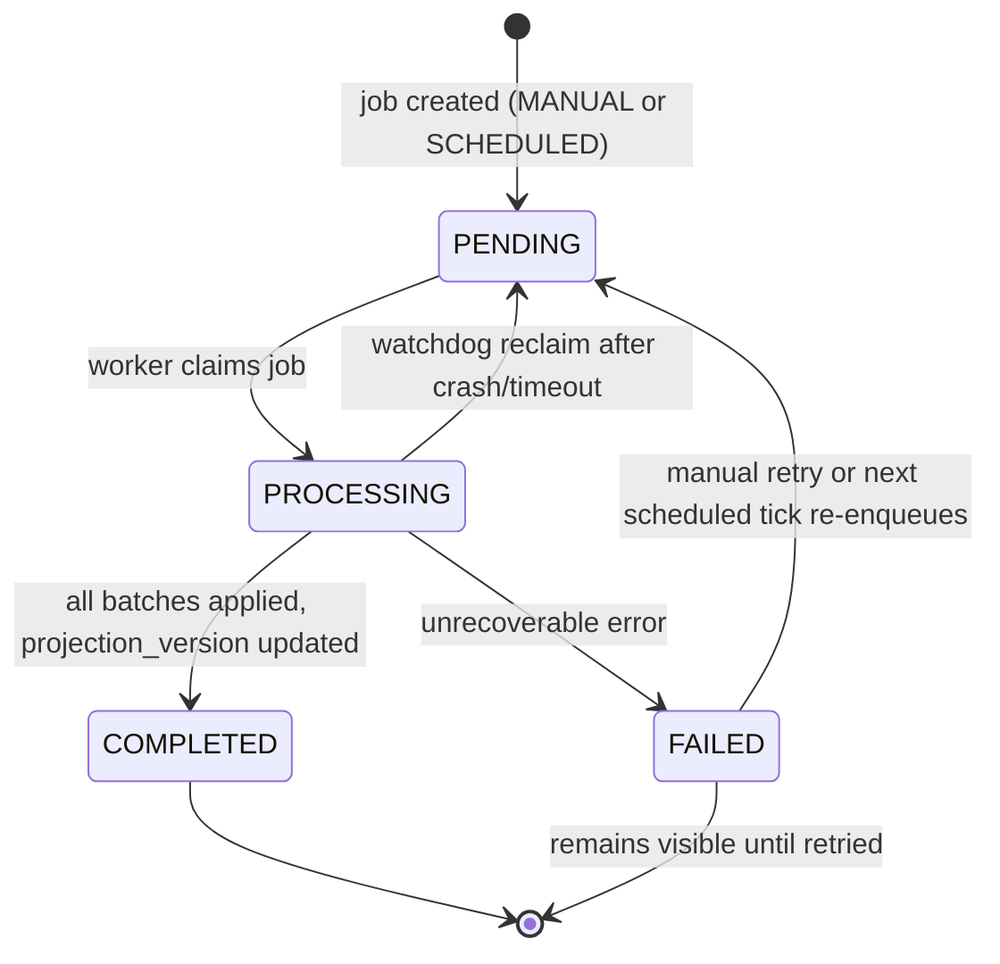

### 39.13 Role / User Group / Permission Conceptual Data Model

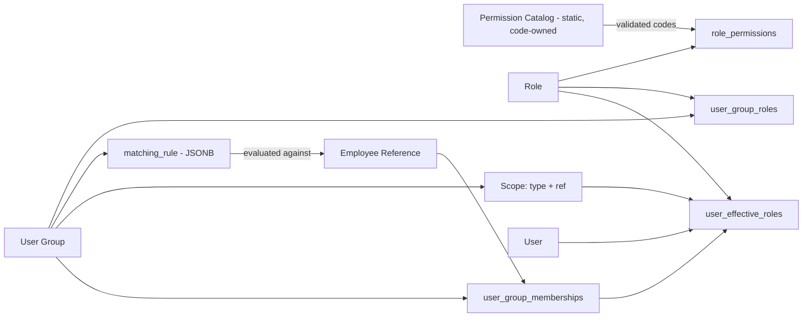

---

## 40. Sequence Diagrams

The sequence diagrams required by this document are provided inline within §39 (39.7–39.12), grouped alongside their corresponding architecture diagrams for readability, rather than duplicated in a separate section. Cross-reference: Role Permission Update (§39.7), Employee Becoming a Manager (§39.8), User Group Rule Change + Sync Now (§39.9), Scheduled Reconciliation (§39.10), Redis Cache Miss Recovery (§39.11), Synchronization Job Lifecycle (§39.12).

---

## 41. Architecture Decision Records

### ADR-A1: Authorization Remains Inside `access-service`

**Context:** Authorization needs the same `RequestContext` Authentication already produces on every request; a separate service would require a synchronous network dependency on the request path.
**Decision:** Authorization is implemented as a new internal domain inside `hros-access-service`, not a new service.
**Alternatives considered:** A standalone `hros-authorization-service` (rejected — reintroduces the exact request-path service-to-service coupling the existing Authentication architecture's ADR-5/ADR-6 reject for business services).
**Consequences:** Shared deployable, shared database, shared release pipeline with Authentication; internal modular boundaries (§35) substitute for repository boundaries to keep the domains conceptually separate.
**Risks:** Coupling Authorization's release cadence to Authentication's.
**Mitigations:** Strict internal module dependency direction (§35.1–§35.2); no shared entities between domains; the boundary is enforceable by code review even without a repository boundary.

### ADR-A2: Permissions Are a Static, Code-Owned Catalog, Not Database Records

**Context:** Permissions are platform-owned and change only alongside application code that enforces them.
**Decision:** A source-controlled YAML catalog, loaded into memory at startup (§5).
**Alternatives considered:** A `permissions` database table (rejected — implies tenant-editability that doesn't exist, and adds a runtime dependency for a value that's actually deployment-constant).
**Consequences:** Zero-I/O Permission lookups; catalog changes ship as part of a normal `access-service` deployment.
**Risks:** A bad catalog change ships with a deployment rather than being independently rollback-able.
**Mitigations:** Startup-time validation gates readiness (§36); standard Kubernetes rollout/rollback handles a bad catalog like any other bad deployment.

### ADR-A3: Permission Codes Are the Stable Identifier — No Database IDs

**Context:** Permission identifiers must be portable across environments and stable across the polyrepo.
**Decision:** `resource.action` string `id`s are the only identifier; no numeric/UUID surrogate key exists for a Permission.
**Alternatives considered:** A generated database ID with `id` as a secondary unique column (rejected — adds a layer of indirection with no benefit, since the string is already globally unique and human-readable).
**Consequences:** `role_permissions.permission_code` stores the string directly (§6.1); Redis/L1 values use the string directly.
**Risks:** Renaming a Permission `id` is a breaking change.
**Mitigations:** Deprecation lifecycle (§5.7) treats renames as remove-then-add, never an in-place rename.

### ADR-A4: Roles Store Permission Codes Directly, No Foreign Key to a Permissions Table

**Context:** No `permissions` table exists (ADR-A2); `role_permissions` needs referential meaning without one.
**Decision:** `role_permissions.permission_code` is a validated string, checked against the in-memory catalog at write time, with a read-time defensive fallback for drift (§5.8).
**Alternatives considered:** A synthetic `permissions` table solely to hold a foreign key target (rejected — reintroduces the database-record model ADR-A2 explicitly avoids, for no referential-integrity benefit beyond what application-layer validation already provides).
**Consequences:** Simpler schema; validation responsibility shifts fully to `RoleModule` and the catalog loader.
**Risks:** A code path that bypasses `RoleModule`'s validation could write an invalid code.
**Mitigations:** All writes go through `RoleModule`'s single write path (§6.4); read-time drift detection (§5.8) prevents an invalid code from silently granting unintended access.

### ADR-A5: Dynamic User Groups Provide Role Assignment (Not Direct User-to-Role Assignment)

**Context:** The PRD requires Roles to be delivered to populations automatically, not assigned per-individual at scale.
**Decision:** The only path from a Role to a user is through a User Group's materialized membership (§7, §11, §12); there is no direct `user_roles` table for ad hoc individual assignment.
**Alternatives considered:** A direct `user_roles` table alongside User Groups, for one-off exceptions (deferred — not required by the current PRD; would need its own impact-visibility/audit treatment if added later, and is left as an Open Technical Decision, §43, rather than built speculatively).
**Consequences:** Every grant of access is traceable to a User Group, simplifying the mental model and the audit story.
**Risks:** No clean mechanism for a genuine one-off exception without creating a single-member User Group.
**Mitigations:** A single-member User Group (a valid, if narrow, use of the existing model) is an acceptable workaround until/unless direct assignment is confirmed as a real requirement.

### ADR-A6: Scope Is Attached to the User Group for the Initial Model

**Context:** PRD Assumption 3 states one Scope per User Group, applied uniformly to every Role it assigns.
**Decision:** `scope_type`/`scope_ref_*` are columns on `user_groups` (§7.1, §8), not a separate per-Role-per-group table.
**Alternatives considered:** A `user_group_role_scopes` join table supporting a distinct Scope per assigned Role (deferred — no current business requirement per PRD Open Question 3; would be the natural migration path if that requirement is later confirmed).
**Consequences:** Simpler schema and simpler Scope evaluation (§17.4) for the current requirement.
**Risks:** A future per-Role-scope requirement requires a schema migration and a `user_effective_roles`/Redis-value shape change.
**Mitigations:** `user_effective_roles` already stores Scope per `(user, role, source_group)` row (§12.2), which happens to already be the right granularity to absorb a future per-Role Scope without a structural redesign — only the write path (where Scope is read from) would need to change.

### ADR-A7: User Group Memberships Are Materialized

**Context:** Evaluating every User Group's rule on every request would violate the "avoid recalculating from scratch" architectural goal.
**Decision:** `user_group_memberships` (§11) is a durable, derived table, kept current via targeted reevaluation (§19) and rebuild jobs (§20–§22), never computed inline on the request path.
**Alternatives considered:** On-demand rule evaluation with a short-TTL cache (rejected — reintroduces rule evaluation into the hot or near-hot path, and complicates the "Role change is cheap" guarantee since membership would need to be considered part of the same cache invalidation surface).
**Consequences:** Membership changes are explicit, auditable state transitions rather than implicit cache side effects.
**Risks:** Materialization can drift from the true rule evaluation if a bug exists in the reconciler.
**Mitigations:** Both update paths (single-employee and full rebuild, §11.3) share one reconciler implementation, minimizing the surface where drift could be introduced.

### ADR-A8: Effective User Roles Are Materialized

**Context:** Redis rebuild (§29) and bootstrap (§15) both need "what Roles does this user hold, with what Scope" without evaluating membership or Role definitions from scratch.
**Decision:** `user_effective_roles` (§12) is a durable projection derived from `user_group_memberships` + `user_group_roles`, rebuilt incrementally per affected user.
**Alternatives considered:** Deriving this on-demand at Redis-rebuild time via a join across `user_group_memberships`/`user_group_roles`/`user_groups` (rejected — works, but reintroduces a multi-table join onto the cold-cache-recovery path that a pre-materialized table avoids entirely; also loses a clean, independently queryable "current effective state" table for audit/debugging).
**Consequences:** One more table to keep consistent, in exchange for the fastest possible Redis-rebuild path (§29.2).
**Risks:** Same drift risk class as ADR-A7.
**Mitigations:** Same mitigation — single reconciler, narrow update scope per change.

### ADR-A9: Redis Caches User→Roles and Role→Permissions Separately

**Context:** Architectural goal: Role Permission changes must not require updating thousands of users.
**Decision:** Two independently-keyed Redis structures (§13.1–§13.3), never merged into one per-user blob.
**Alternatives considered:** A single per-user cache embedding both Roles and their resolved Permissions (rejected — directly violates the stated goal; explored and rejected explicitly, ADR-A10).
**Consequences:** A Role change is one Redis `SET`, regardless of population size (§18.2); a per-request read costs one extra small Redis lookup relative to a fully-flattened design, judged an acceptable trade-off given the goals.
**Risks:** Slightly more Redis round trips per authorization check than a single-blob design.
**Mitigations:** L1 cache (§14) absorbs the `authz:role:*` half of that extra cost for the common case (few distinct Roles, reused very frequently).

### ADR-A10: Flattened User→Permissions Is Not the Canonical Model

**Context:** A naive design would store each user's fully-resolved Permission list directly.
**Decision:** Explicitly rejected as the canonical runtime model, in favor of ADR-A9's split.
**Alternatives considered:** Flattened per-user Permissions, optionally as a _derived, disposable_ cache layered on top of the split model (considered as a possible future micro-optimization if the extra Redis lookup in ADR-A9 ever proves to be a measured bottleneck; not adopted now — no evidence of need, and it would reintroduce the mass-update-on-Role-change cost that ADR-A9 exists to avoid, so it would need to be invalidated exactly as carefully as it is currently avoided).
**Consequences:** None beyond ADR-A9's.
**Risks:** None beyond ADR-A9's.
**Mitigations:** N/A — this ADR exists to record the explicit rejection and its reasoning, not to introduce new consequences.

### ADR-A11: Bootstrap Never Evaluates User Group Rules

**Context:** Fast post-login rendering is an explicit architectural goal.
**Decision:** Bootstrap (§15) reads only already-materialized Redis/PostgreSQL state; it never touches `matching_rule` or `user_groups` at all.
**Alternatives considered:** Lazily evaluating membership at first bootstrap if not yet materialized (rejected — reintroduces unbounded rule-evaluation latency onto a user-facing, latency-sensitive path; materialization is instead kept current continuously via §19/§20–§22, so bootstrap can always assume it's already done).
**Consequences:** Bootstrap latency is bounded and predictable, independent of how complex a tenant's User Group rules are.
**Risks:** A brand-new employee whose initial membership hasn't yet been materialized (a timing gap between employee creation and first matching evaluation) could bootstrap with incomplete access.
**Mitigations:** Employee-creation events (`employee.created`) trigger immediate matching evaluation (§19) as part of the same event-driven flow used for any attribute change — by the time an invited employee actually logs in (which requires completing invitation acceptance, itself not instantaneous), materialization has almost certainly already completed; this is judged acceptable and is noted as a Recommended Default assumption rather than a guaranteed real-time bound (§43).

### ADR-A12: Role Permission Changes Do Not Trigger Mass-User Rebuild

**Context:** Explicit architectural goal #5.
**Decision:** Realized structurally by ADR-A9's cache split (§18.2) — a Role change touches exactly one shared Redis key and zero `user_effective_roles`/`user_group_memberships` rows.
**Alternatives considered:** None seriously — this is the direct consequence of ADR-A9, not an independent design choice.
**Consequences:** Role administration is always fast and always immediately consistent (§18.4), satisfying the PRD's prompt-revocation requirement for this change type without any special-case "urgent job" machinery.
**Risks:** None beyond ADR-A9's.
**Mitigations:** N/A.

### ADR-A13: User Group Changes May Use Controlled Asynchronous Synchronization

**Context:** A User Group change can affect a population large enough that synchronous application within an HTTP request is infeasible.
**Decision:** User Group changes are always applied via the job model (§21–§23), never inline on the save request.
**Alternatives considered:** Synchronous application for "small" User Groups, asynchronous only above a threshold (rejected for the initial product — adds a second code path and a threshold-tuning problem for a benefit that's marginal, since even a synchronous small-population apply still benefits from going through the same job model's audit/status visibility; simpler to always go through one path, per YAGNI).
**Consequences:** Every User Group save, regardless of size, shows a "Pending Synchronization" status and a Sync Now option (PRD §5.10/§5.16) — consistent, predictable administrator experience.
**Risks:** A trivially small User Group change (e.g., one employee) still incurs job-creation overhead rather than being instant.
**Mitigations:** Job creation/claiming is cheap (§23); a small job completes in well under a second in practice, so the "pending" window is brief even though the mechanism is formally asynchronous.

### ADR-A14: Manual Sync Now and Scheduled Reconciliation Use the Same Rebuild Path

**Context:** Explicit instruction — do not create separate business logic for manual and scheduled sync.
**Decision:** Both create `authorization_sync_jobs` rows (differing only in `trigger_type`) consumed by the identical worker (§21.2, §22.1, §22.5).
**Alternatives considered:** A separate "scheduled batch processor" optimized for bulk, distinct from a "Sync Now handler" optimized for responsiveness (rejected — the underlying rebuild work is identical; optimizing for responsiveness is achieved by _when_ the job is created and claimed, not by a different rebuild algorithm).
**Consequences:** One rebuild implementation to test, monitor, and reason about; consistent status semantics regardless of trigger.
**Risks:** None material.
**Mitigations:** N/A.

### ADR-A15: Redis Is Runtime Acceleration; PostgreSQL Remains the Durable Source

**Context:** Explicit architectural goal — Authorization runtime state must be rebuildable from durable PostgreSQL state.
**Decision:** Every Redis Authorization key has a defined, cheap PostgreSQL rebuild path (§29); Redis data loss is never a data-loss event for Authorization configuration.
**Alternatives considered:** Treating Redis as authoritative for performance-critical paths with periodic PostgreSQL sync (rejected — inverts the durability guarantee the PRD's audit/compliance requirements depend on, and contradicts the explicit architectural goal).
**Consequences:** Authorization inherits the same fail-closed, rebuildable-cache philosophy already proven for Authentication sessions, applied to a domain where the durable source is even more clearly authoritative (there is no equivalent of "the session itself only ever lived in Redis" for Authorization — everything in Redis here has a PostgreSQL origin).
**Risks:** None beyond normal cache-rebuild latency (§29).
**Mitigations:** N/A.

### ADR-A16: API Authorization Remains Independent from Frontend Permission Visibility

**Context:** A compromised, buggy, or stale frontend must never be able to grant access it shouldn't have.
**Decision:** The Authorization Guard (§17) is the sole enforcement point for every business API; the bootstrap payload (§15) is documented and treated as UX-only, never as an authorization mechanism.
**Alternatives considered:** Trusting a signed bootstrap payload as a lightweight authorization token for subsequent requests (rejected — reintroduces exactly the risk of an authorization decision going stale relative to the true, current Role/Scope state, and duplicates what the Authorization Guard already does correctly and cheaply).
**Consequences:** Every protected request pays the (small) cost of a real guard check; no request is ever authorized purely by trusting client-supplied state.
**Risks:** None beyond the guard's own latency (§34), already budgeted as part of normal request handling.
**Mitigations:** N/A.

### ADR-A17: Authentication and Authorization Remain Separate Domains Inside the Same Deployable

**Context:** Both domains must coexist in `hros-access-service` without becoming entangled.
**Decision:** Separate table groups, separate NestJS modules with a one-directional dependency (Authorization reads `RequestContext`; Authentication has zero awareness of Authorization), and a narrow, explicit integration surface (the Authorization Guard as an additional, optional `@hros/libs-apis` export, §17.3).
**Alternatives considered:** Merging session validation and permission checking into a single combined guard (rejected — would force every consumer of `@hros/libs-apis` to adopt Authorization even if they have no Authorization-gated routes yet, and would make it harder to reason about which failures are "who are you" vs. "what can you do").
**Consequences:** Authentication's existing architecture, ADRs, and operational behavior are preserved unmodified; Authorization is purely additive.
**Risks:** Two domains sharing a deployable could, over time, accumulate accidental coupling if module boundaries aren't enforced.
**Mitigations:** The prohibited-dependency list (§35.2) and code review are the enforcement mechanism, mirroring how the existing architecture already relies on code review (not tooling) for its own internal module boundaries (existing §19.3).

---

## 42. Prohibited Designs

This architecture has been checked against, and does not introduce, any of the following:

- [x] No new deployable service, repository, database, or Kubernetes namespace for Authorization (§2.2, ADR-A1).
- [x] No `permissions` database table — Permissions remain a static, code-owned catalog (§5.1, ADR-A2).
- [x] No database surrogate ID used as a Permission identifier anywhere (§5.3, ADR-A3).
- [x] No foreign key from `role_permissions` to a `permissions` table (§6.1, ADR-A4).
- [x] No flattened `user → permissions` table or cache as the canonical model (§13.4, ADR-A10).
- [x] No Role Permission change ever touches `user_group_memberships`, `user_effective_roles`, or any per-user Redis key (§18.2, ADR-A12).
- [x] No User Group change is ever applied synchronously within the save request (§20.2, ADR-A13).
- [x] No separate rebuild implementation for manual vs. scheduled synchronization (§21–§22, ADR-A14).
- [x] No general-purpose policy/rule language — Matching Criteria use a closed field/operator vocabulary only (§10.2).
- [x] No raw SQL construction from tenant-authored rule input (§10.2, §33).
- [x] No cross-service database query — `access-service` never queries Directory Service's database directly; only the Employee Reference projection is used (§9.1).
- [x] No Redis-miss fallback that re-evaluates User Group rules (§29.1).
- [x] No mass Redis pattern-delete/`FLUSHDB` used for invalidation (§13.5).
- [x] No Authorization module imports an Authentication module's repository/entity directly (§35.2).
- [x] No frontend-supplied authorization claim is ever trusted for API enforcement (§16.1, §17, ADR-A16).
- [x] No separate event-publishing mechanism for Authorization — the existing outbox/`OutboxModule` is reused (§25).
- [x] No domain service (including this new domain) sends email/push directly — notification events only (§26).
- [x] All Mermaid diagrams in §39 use `flowchart`, `sequenceDiagram`, or `stateDiagram-v2` — no unsupported syntax.

---

## 43. Open Technical Decisions

Recommended Defaults and unresolved technical questions, kept explicitly separate from confirmed architecture per the instruction not to silently treat a technical choice as a confirmed product requirement where the PRD does not define one.

### 43.1 Recommended Defaults (Architecture-Level, Not Product-Mandated)

- `authz:user:*` Redis TTL, refreshed on write — a specific duration (e.g., aligned to session max lifetime) needs sign-off; mechanism specified (§13.2), value TBD.
- High-impact threshold value(s) for pre-save confirmation (§18.3, §20.2) and for notification emphasis (§26) — PRD Open Question 6 leaves this a product decision; recommend a single platform-wide default initially, per PRD Assumption 6.
- Sync job batch size (§21.3) — needs load-testing to tune; mechanism specified, value TBD.
- Leader-election/distributed-lock mechanism for the scheduled reconciliation trigger (§22.3) — a Postgres advisory lock vs. a Redis-based lock is an implementation choice with no material product impact; recommend a Postgres advisory lock for simplicity (no additional Redis key-namespace concern) unless operational experience suggests otherwise.
- Job-reclaim (watchdog) timeout for a crashed `PROCESSING` job (§23.6) — needs tuning against realistic batch durations.
- Whether `authz:role:*` is proactively pre-warmed for all `ACTIVE` Roles on pod startup (§13.5) — a cheap optimization, not required for correctness.
- L1 cache eviction policy/cap (§14.4) — recommend a simple LRU cap as a safety net; not required for the initial expected scale.

### 43.2 Unresolved Product Decisions (Inherited from the PRD — Not Resolved Here)

1. Whether Roles from overlapping User Groups should ever be non-additive (PRD Open Question 1) — implemented as strictly additive (§7.3, §12.2 one row per source group); reversible without a structural redesign if a future "deny"/priority concept is confirmed, since `user_effective_roles` already retains per-source-group granularity.
2. Whether Matching Criteria should ever support "or" (PRD Open Question 2) — implemented as "and"-only (§10.2); an "or" combinator would be an additive change to the rule schema and evaluator, not a redesign.
3. Whether Scope should vary per Role within a single User Group (PRD Open Question 3) — implemented as one Scope per group (§7.2, ADR-A6); migration path noted.
4. Reconciliation cadence beyond daily for larger tenants (PRD Open Question 4) — the scheduling mechanism (§22) supports an arbitrary cadence; whether it should differ per tenant is unresolved.
5. Precise definition and SLA for "security-sensitive" revocation urgency (PRD Open Question 5) — a `priority` column on `authorization_sync_jobs` is proposed as the mechanism (§30) but the trigger criteria and target SLA are pending Product/Security definition.
6. High-impact threshold configurability (PRD Open Question 6) — see §43.1.
7. Whether tenants may further restrict (never expand) a System Role's non-protected defaults (PRD Open Question 7) — not implemented; would require a new tenant-level override table if confirmed.
8. Custom Role lineage tracking on copy (PRD Open Question 8) — not implemented (§6.5); an additive `copied_from_role_id` column if confirmed.
9. Limits on the number of Custom Roles/User Groups per tenant (PRD Open Question 9) — not implemented; would be an application-layer count check if confirmed, not a schema change.

### 43.3 Unresolved Technical Decisions

- Whether the Authorization Guard should support a "read-only preview" mode for the frontend to proactively check a single Permission/Scope combination before rendering an action button, beyond what the bootstrap payload already provides (e.g., for actions whose Scope depends on a specific record not known at bootstrap time) — not required by the current PRD; noted as a possible future need.
- Exact mechanism for the "your access changed mid-session" client signal (§16.3) — polling vs. a lightweight push channel; no requirement currently demands real-time push, so polling-on-403 is the simpler default pending evidence of need.
- Whether `authorization_sync_jobs` needs a `priority` column now or only when Open Question 5 is resolved (§30, §43.2 item 5) — recommend adding the column proactively (cheap, additive) even before the exact prioritization policy is finalized, so the policy can be implemented without a schema change later.
- Direct user-to-Role assignment (bypassing User Groups) for one-off exceptions (ADR-A5) — not built; revisit if a real tenant need emerges beyond the single-member-group workaround.
- Whether Permission Catalog validation failures should be a hard startup-probe failure (current recommendation, §36) or a softer "start in degraded mode" — hard failure is recommended for safety (never serve traffic against an unvalidated/inconsistent catalog).

---

## 44. Risks / Proof-of-Concept Requirements

- **Materialized-projection drift risk:** a bug in the shared `MembershipReconciler` (§11.3, §12.3) could cause `user_group_memberships`/`user_effective_roles` to silently diverge from what the current `matching_rule` would actually produce. Recommend a periodic, low-priority reconciliation-audit job (distinct from the synchronization jobs themselves) that spot-checks a sample of materialized memberships against live rule evaluation and alerts on divergence, as a proof-of-concept before relying on materialization exclusively at large tenant scale.
- **Large-tenant rebuild throughput:** batching (§21.3) and set-based SQL evaluation (§10.4b) are the proposed mechanism for tenants with tens of thousands of employees; actual throughput under a realistic worst-case Scope-change or Matching-Criteria-change needs load testing before committing to a specific batch size and worker-pod count recommendation (§43.1).
- **Attribute-dependency index correctness at scale:** `rule_attribute_keys` (§10.3) must stay perfectly in sync with `matching_rule` on every save; a proof-of-concept should verify the array-overlap query (`&&`) performs well with a realistic number of User Groups per tenant and confirm no group is ever incorrectly skipped.
- **Leader-election reliability for scheduled reconciliation** (§22.3, ADR question in §43.1): needs a proof-of-concept under pod rolling-restart and network-partition conditions to confirm exactly-one-trigger-per-tick behavior holds in practice, not just in the common case.
- **L1 cache correctness under version-check contention:** a proof-of-concept should confirm the version-comparison invalidation approach (§14.2) does not introduce a measurable staleness window beyond "one Redis round trip" under realistic request concurrency, particularly immediately following a Role Permission revocation, given the PRD's "prompt" requirement for that case.
- **Redis Authorization key sizing at scale:** capacity planning (§28) assumed "small" per-user/per-Role values; a proof-of-concept should confirm actual memory footprint at the largest supported tenant's population and Role/Group count before finalizing cluster sizing shared with the existing Authentication session keys.
- **Bootstrap latency budget:** the hot path (§15.2) is designed to require roughly one Redis read plus a handful of small Role lookups; a proof-of-concept should measure actual p95/p99 latency for a user holding an unusually large number of Roles (e.g., an administrator matching many User Groups) to confirm the "small in-memory union" step doesn't become a hidden cost at the tail.

---

_End of `SYSTEM_OVERVIEW.md`._
