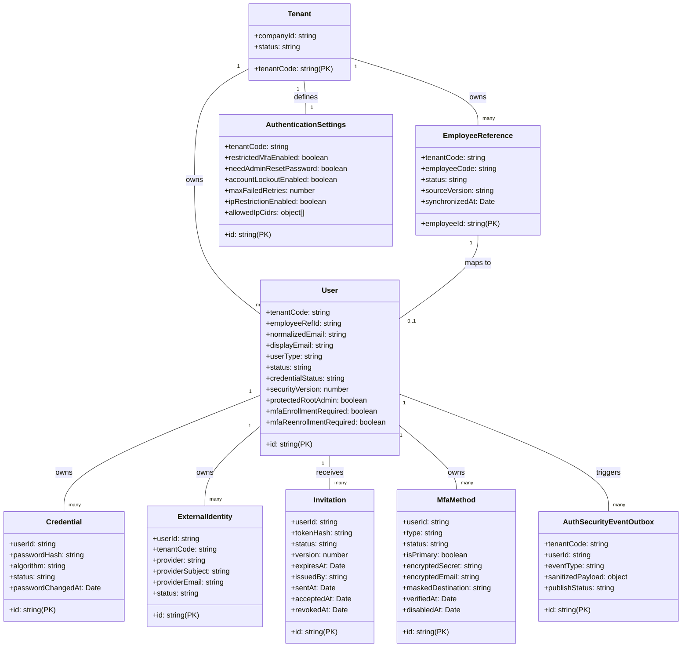

# Data Model: Identity Entities

This document defines the physical and logical data model design for the identity management database entities of the Access Service.

## Entity Mapping & Schema Overview



---

## Detailed Entity Specifications

### 1. Tenant Entity
- **Table**: `tenants`
- **Class**: `Tenant` (Standard TypeORM Entity)
- **Fields**:
  - `tenantCode` (varchar(50), PK): Unique business code (e.g. `tenant_code`).
  - `companyId` (varchar(100), UNIQUE): Linked enterprise identity.
  - `status` (varchar(30)): Tenant status (e.g. `active`, `suspended`).
- **Validation**: `tenantCode` and `companyId` are required.

### 2. EmployeeReference Entity
- **Table**: `employee_references`
- **Class**: `EmployeeReference` (Standard TypeORM Entity)
- **Fields**:
  - `employeeId` (uuid, PK): Internal employee identity mapping (e.g. `employee_id`).
  - `tenantCode` (varchar(50)): Owner tenant code.
  - `employeeCode` (varchar(100)): Code unique within the tenant.
  - `status` (varchar(30)): Status (e.g. `active`, `terminated`).
  - `sourceVersion` (varchar(100), nullable): Sync version string.
  - `synchronizedAt` (timestamptz): Last synced timestamp.
- **Relationships**:
  - ManyToOne -> `Tenant` via `tenantCode` (RESTRICT)
- **Constraints**:
  - Composite Unique constraint on `(tenant_code, employee_code)`.
  - Composite Unique constraint on `(tenant_code, employee_id)` to serve composite key mapping.

### 3. User Entity
- **Table**: `users`
- **Class**: `User` (Inherits `BaseEntity`)
- **Fields** (inherits `id`, `tenantCode`, `createdAt`, `updatedAt`, `deletedAt`, `version` from `BaseEntity`):
  - `employeeRefId` (uuid, nullable): Reference to employee profile.
  - `normalizedEmail` (varchar(320)): Normalized lowercase login email.
  - `displayEmail` (varchar(320)): Formatted original email.
  - `userType` (varchar(30)): Role/type classifier (e.g., `admin`, `standard`).
  - `status` (varchar(30)): User lifecycle state (e.g. `pending`, `active`, `suspended`).
  - `credentialStatus` (varchar(30)): Credential state tracking (e.g. `valid`, `expired`, `temporary`).
  - `securityVersion` (integer): Tracks password/security revisions to force token de-authorization on changes.
  - `protectedRootAdmin` (boolean): Exclusion flag from standard tenant lockout.
  - `mfaEnrollmentRequired` (boolean): Flag forcing MFA setup.
  - `mfaReenrollmentRequired` (boolean): Flag forcing MFA updates.
- **Relationships**:
  - OneToOne -> `EmployeeReference` via composite FK `(tenantCode, employeeRefId)` mapping to `(tenantCode, employeeId)` (RESTRICT).
- **Constraints**:
  - Unique email within a single tenant `(tenant_code, normalized_email)`.
  - Unique index allowing only one `protected_root_admin = TRUE` per `tenant_code`.

### 4. Credential Entity
- **Table**: `credentials`
- **Class**: `Credential` (Standard TypeORM Entity with primary `id: UUID`)
- **Fields**:
  - `id` (uuid, PK): Unique identifier.
  - `userId` (uuid): Reference to owner user.
  - `passwordHash` (text): Encrypted password block.
  - `algorithm` (varchar(50)): Algorithm string (e.g., `bcrypt`, `argon2id`).
  - `status` (varchar(30)): Status (e.g. `active`, `revoked`).
  - `passwordChangedAt` (timestamptz, nullable): Password set timestamp.
- **Relationships**:
  - ManyToOne -> `User` via `userId` (CASCADE).
- **Constraints**:
  - Unique active password per user: Partial Unique index on `(user_id)` where `status = 'active'`.

### 5. ExternalIdentity Entity
- **Table**: `external_identities`
- **Class**: `ExternalIdentity` (Inherits `BaseEntity`)
- **Fields** (inherits standard metadata columns):
  - `userId` (uuid): Reference to mapped user.
  - `provider` (varchar(50)): Single Sign-On provider (e.g., `google`, `azure-ad`).
  - `providerSubject` (varchar(255)): Provider's unique subject key.
  - `providerEmail` (varchar(320), nullable): Mapped email from provider.
  - `status` (varchar(30)): Mapping status (e.g. `active`, `suspended`).
- **Relationships**:
  - ManyToOne -> `User` via `userId` (CASCADE).
  - ManyToOne -> `Tenant` via `tenantCode` (RESTRICT).
- **Constraints**:
  - Provider identifier unique per tenant: Unique constraint on `(tenant_code, provider, provider_subject)`.
  - One mapping per provider type per user: Unique constraint on `(user_id, provider)`.

### 6. Invitation Entity
- **Table**: `invitations`
- **Class**: `Invitation` (Standard TypeORM Entity)
- **Fields**:
  - `id` (uuid, PK): Invitation ID.
  - `userId` (uuid): Mapped user to activate.
  - `tokenHash` (text): Hashed activation verification token.
  - `status` (varchar(30)): Invitation status (e.g. `pending`, `sent`, `accepted`, `revoked`).
  - `version` (integer): Optimistic locking version.
  - `expiresAt` (timestamptz): Token expiry.
  - `issuedBy` (uuid, nullable): Admin user who sent invitation.
  - `sentAt` (timestamptz, nullable): Sent timestamp.
  - `acceptedAt` (timestamptz, nullable): Accepted timestamp.
  - `revokedAt` (timestamptz, nullable): Revocation timestamp.
- **Relationships**:
  - ManyToOne -> `User` via `userId` (CASCADE).
  - ManyToOne -> `User` via `issuedBy` (SET NULL).
- **Constraints**:
  - Hashed token must be unique globally.
  - At most one invitation can be active at a time per user: Partial Unique index on `(user_id)` where `status IN ('pending', 'sent')`.

### 7. MfaMethod Entity
- **Table**: `mfa_methods`
- **Class**: `MfaMethod` (Standard TypeORM Entity)
- **Fields**:
  - `id` (uuid, PK): MFA method ID.
  - `userId` (uuid): Mapped user.
  - `type` (varchar(30)): Type (e.g. `totp`, `email`).
  - `status` (varchar(30)): Status (e.g. `active`, `disabled`, `pending`).
  - `isPrimary` (boolean): Priority method flag.
  - `encryptedSecret` (text, nullable): Encrypted TOTP secret.
  - `encryptedEmail` (text, nullable): Encrypted destination email.
  - `maskedDestination` (varchar(255), nullable): Masked address representation (e.g. `u***r@d***n.com`).
  - `verifiedAt` (timestamptz, nullable): Verification timestamp.
  - `disabledAt` (timestamptz, nullable): Deactivation timestamp.
- **Relationships**:
  - ManyToOne -> `User` via `userId` (CASCADE).
- **Constraints**:
  - Only one primary active MFA method per user: Partial Unique index on `(user_id)` where `is_primary = TRUE AND status = 'active'`.

### 8. AuthenticationSettings Entity
- **Table**: `authentication_settings`
- **Class**: `AuthenticationSettings` (Inherits `BaseEntity`)
- **Fields** (inherits standard metadata columns):
  - `restrictedMfaEnabled` (boolean): Enforce MFA enrollment.
  - `needAdminResetPassword` (boolean): Block self-service password reset.
  - `accountLockoutEnabled` (boolean): Flag enabling lockouts on retries.
  - `maxFailedRetries` (integer): Maximum failed login attempts allowed.
  - `ipRestrictionEnabled` (boolean): Enable IP address checking.
  - `allowedIpCidrs` (jsonb): JSON list of allowed IP blocks.
- **Relationships**:
  - OneToOne -> `Tenant` via `tenantCode` (CASCADE).
- **Constraints**:
  - Unique settings block per tenant.
  - Retries must be > 0.
  - IP Whitelist must be formatted as JSON array.

### 9. AuthSecurityEventOutbox Entity
- **Table**: `auth_security_events_outbox`
- **Class**: `AuthSecurityEventOutbox` (Inherits `BaseEntity`)
- **Fields** (inherits standard metadata columns):
  - `userId` (uuid, nullable): Related user initiating the event.
  - `eventType` (varchar(100)): Class of security event (e.g. `auth.login_failed`, `credential.password_changed`).
  - `sanitizedPayload` (jsonb): Sanitized payload details.
  - `publishStatus` (varchar(30)): Outbox message processing state (`pending`, `processed`, `failed`).
- **Relationships**:
  - ManyToOne -> `User` via `userId` (SET NULL).
  - ManyToOne -> `Tenant` via `tenantCode` (RESTRICT).
- **Constraints**:
  - Payload must be formatted as a JSON object.

---

## State Transitions

### User lifecycle
```
  [Pending] --------> [Active] --------> [Suspended]
      |                 ^  |                 |
      +---> [Invited]---+  +-----------------+
```
1. **Pending**: Initial state upon automated tenant provisioning.
2. **Invited**: Activation email sent, waiting for user enrollment.
3. **Active**: Fully validated account. Can authenticate.
4. **Suspended**: Account blocked by admin or security lockout policies.
