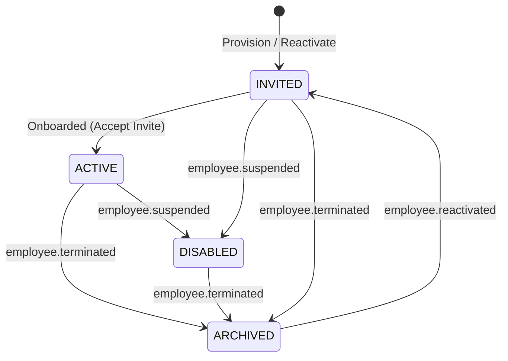

# Data Model: Employee Status Synchronization

This document specifies the database entities, fields, constraints, relationships, validations, and state transitions required for the employee status synchronization feature.

## Database Entities

### 1. User (`users` table)
Represents the authentication identity of a user in a tenant.

| Field | Database Type | Constraints | Description |
| :--- | :--- | :--- | :--- |
| `id` | UUID | Primary Key (extends `BaseEntity`) | Unique identifier for the user. |
| `tenantCode` | VARCHAR(50) | Not Null, Composite Unique | Code of the tenant the user belongs to. |
| `employeeRefId` | UUID | Nullable, Composite Foreign Key | Reference to the employee profile in the HR domain. |
| `normalizedEmail` | VARCHAR(320) | Not Null, Composite Unique | Normalized email address for lookup. |
| `displayEmail` | VARCHAR(320) | Not Null | Display email address. |
| `userType` | VARCHAR(30) | Not Null | E.g. `admin`, `employee`. |
| `status` | VARCHAR(30) | Not Null | E.g. `active`, `disabled`, `archived`, `invited`. |
| `credentialStatus` | VARCHAR(30) | Not Null | E.g. `pending`, `active`, `expired`. |
| `securityVersion` | INT | Not Null, Default: `1` | Monotonic counter incremented on access changes to invalidate existing JWT sessions. |

* **Constraints & Indexes**:
  - Unique index: `uq_users_tenant_normalized_email` (`tenant_code`, `normalized_email`)
  - Foreign key: `employeeRefId` and `tenantCode` -> `employee_references` (`employee_id`, `tenant_code`)

---

### 2. Employee Reference (`employee_references` table)
Tracks the connection between the authentication user and the HR domain employee record.

| Field | Database Type | Constraints | Description |
| :--- | :--- | :--- | :--- |
| `employeeId` | UUID | Primary Key | Employee ID from the Directory/HR domain. |
| `tenantCode` | VARCHAR(50) | Not Null, Composite Unique | Tenant code of the employee. |
| `employeeCode` | VARCHAR(100) | Not Null, Composite Unique | Employee business code. |
| `status` | VARCHAR(30) | Not Null | Current employee lifecycle status in the HR domain. |
| `sourceVersion` | VARCHAR(100) | Nullable | Monotonic event sequence version from Directory service. |
| `synchronizedAt` | TIMESTAMPTZ | Default: `NOW()` | Timestamp when the reference was last updated. |

* **Constraints & Indexes**:
  - Unique index: `uq_employee_references_tenant_employee_code` (`tenant_code`, `employee_code`)
  - Unique index: `uq_employee_references_tenant_employee_id` (`tenant_code`, `employee_id`)

---

### 3. Invitation (`invitations` table)
Manages the onboarding invitations for users.

| Field | Database Type | Constraints | Description |
| :--- | :--- | :--- | :--- |
| `id` | UUID | Primary Key | Unique ID of the invitation. |
| `userId` | UUID | Not Null, Foreign Key | ID of the associated user. |
| `tokenHash` | TEXT | Not Null, Unique | Secure one-way SHA-256 hash of the invitation token. |
| `status` | VARCHAR(30) | Not Null | E.g. `pending`, `accepted`, `revoked`. |
| `version` | INT | Not Null, Default: `1` | TypeORM version column for optimistic locking. |
| `expiresAt` | TIMESTAMPTZ | Not Null | Expiry date of the invitation. |
| `sentAt` | TIMESTAMPTZ | Nullable | Timestamp when invitation was sent. |
| `acceptedAt` | TIMESTAMPTZ | Nullable | Timestamp when invitation was accepted. |
| `revokedAt` | TIMESTAMPTZ | Nullable | Timestamp when invitation was revoked. |

* **Constraints & Indexes**:
  - Foreign key: `user_id` -> `users` (`id`) with `ON DELETE CASCADE`

---

### 4. Auth Security Event Outbox (`auth_security_events_outbox` table)
Reliable transactional outbox queue for outbound security and notification events.

| Field | Database Type | Constraints | Description |
| :--- | :--- | :--- | :--- |
| `id` | UUID | Primary Key (extends `BaseEntity`) | Unique ID of the outbox record. |
| `tenantCode` | VARCHAR(50) | Not Null | Tenant code of the event. |
| `userId` | UUID | Nullable, Foreign Key | ID of the associated user. |
| `eventType` | VARCHAR(100) | Not Null | E.g., `authentication.sessions-revoked`, `authentication.user-invited`. |
| `sanitizedPayload` | JSONB | Not Null, Default: `'{}'` | Event message payload containing non-sensitive details. |
| `publishStatus` | VARCHAR(30) | Not Null, Default: `'pending'` | Status of publishing (e.g., `pending`, `published`, `failed`). |

---

## State Transitions

### User Status Lifecycle

### State Mutations by Event

1. **`employee.suspended`**
   - User `status` -> `DISABLED`
   - User `securityVersion` -> incremented by 1
   - EmployeeReference `status` -> `'suspended'`
   - EmployeeReference `sourceVersion` -> updated to event `sourceVersion`

2. **`employee.terminated`**
   - User `status` -> `ARCHIVED`
   - User `securityVersion` -> incremented by 1
   - EmployeeReference `status` -> `'terminated'`
   - EmployeeReference `sourceVersion` -> updated to event `sourceVersion`
   - Active invitations -> status updated to `'revoked'`, `revokedAt` set to current time

3. **`employee.reactivated`**
   - User `status` -> `INVITED`
   - User `securityVersion` -> incremented by 1
   - EmployeeReference `status` -> `'reactivated'`
   - EmployeeReference `sourceVersion` -> updated to event `sourceVersion`
   - Active invitations -> status updated to `'revoked'`, `revokedAt` set to current time
   - New invitation -> status `'pending'`, expires in 24 hours, new token hash generated
