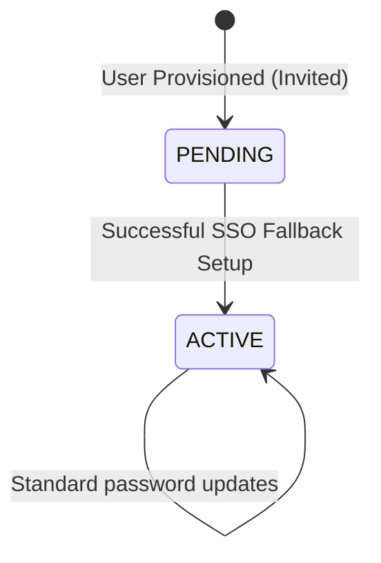
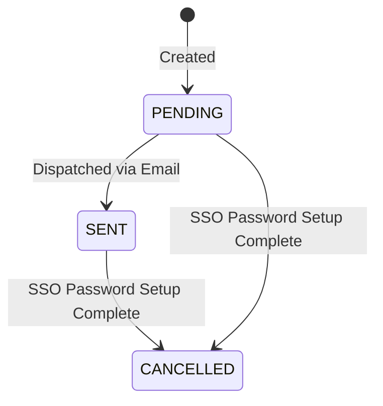

# Data Model Design: Password Setup via Company Single Sign-On (Fallback Path)

This document outlines the database entities, validation rules, and state transitions for the SSO fallback password setup feature.

## 1. Relational Entities (PostgreSQL)

### Entity: User (`users` table)

Represents the core employee identity within a specific tenant context.

| Column | Type | Nullable | Constraints | Description |
| --- | --- | --- | --- | --- |
| `id` | `uuid` | No | Primary Key | Unique user identifier. |
| `tenant_code` | `varchar(30)` | No | Composite Unique Key | Tenant partition key. |
| `status` | `varchar(30)` | No | `UserStatus` Enum | Account state: transitions `PENDING` -> `ACTIVE`. |
| `credential_status` | `varchar(30)` | No | `CredentialStatus` Enum | Credential state: transitions `EMPTY`/`PENDING` -> `CONFIGURED`. |
| `security_version` | `integer` | No | Default: `1` | Incremented during security credential modifications. |
| `mfa_enrollment_required` | `boolean` | No | Default: `false` | Indicates if mandatory MFA setup applies. |

### Entity: Credential (`credentials` table)

Holds secure credential verification data associated with users.

| Column | Type | Nullable | Constraints | Description |
| --- | --- | --- | --- | --- |
| `id` | `uuid` | No | Primary Key | Unique identifier. |
| `tenant_code` | `varchar(30)` | No | Foreign Key to User | Tenant partition key. |
| `user_id` | `uuid` | No | Foreign Key to User | Owner reference. |
| `type` | `varchar(30)` | No | Default: `'password'` | Credential type category. |
| `password_hash` | `varchar(255)` | No | - | Salted Argon2id hash. |
| `algorithm` | `varchar(30)` | No | Default: `'argon2id'` | Cryptographic algorithm format. |
| `status` | `varchar(30)` | No | Default: `'active'` | Active/inactive state flag. |

- *Database Constraint*: Partial composite unique index `uq_credentials_one_active_per_user` on `(tenant_code, user_id)` where `status = 'active'` prevents dual active password rows.

### Entity: Invitation (`invitations` table)

Represents pending, sent, or cancelled invites to employees.

| Column | Type | Nullable | Constraints | Description |
| --- | --- | --- | --- | --- |
| `id` | `uuid` | No | Primary Key | Unique invite identifier. |
| `tenant_code` | `varchar(30)` | No | Foreign Key to User | Tenant partition key. |
| `user_id` | `uuid` | No | Foreign Key to User | Invitee reference. |
| `status` | `varchar(30)` | No | `InvitationStatus` Enum | State: transitions `pending`/`sent` -> `cancelled`. |

### Entity: AuthSecurityEventOutbox (`auth_security_events_outbox` table)

Transactional outbox table for reliable asynchronous auditing and notification dispatches.

| Column | Type | Nullable | Constraints | Description |
| --- | --- | --- | --- | --- |
| `id` | `uuid` | No | Primary Key | Unique event ID (Kafka message key). |
| `tenant_code` | `varchar(30)` | No | - | Tenant partition identifier. |
| `aggregate_type` | `varchar(50)` | No | - | Domain model name (`'User'`). |
| `aggregate_id` | `varchar(50)` | No | - | User reference ID (`userId`). |
| `event_type` | `varchar(100)` | No | - | Topic identifier (e.g. `'authentication.password-changed'`). |
| `payload` | `jsonb` | No | - | Sanitized JSON data payload (no plaintext passwords). |
| `publish_status` | `varchar(30)` | No | Default: `'pending'` | Dispatching queue state. |
| `created_at` | `timestamp` | No | Default: `NOW()` | Audit logging timestamp. |

---

## 2. In-Memory Session Model (Redis)

### Key Pattern: `auth:sso-setup:{flowId}`
- **Type**: Hash Map (`HSET`)
- **TTL**: 15 Minutes (900 seconds)
- **Key Attributes**:
  - `userId`: Target user UUID.
  - `tenantCode`: Target tenant code string.
  - `authState`: Session status value, must equal `'sso-setup-pending'`.
- **Validation**: Enforced via `RestrictedSessionGuard` intercepting routes.

---

## 3. State Transitions

### User Account State Transition

### Invitation State Transition

