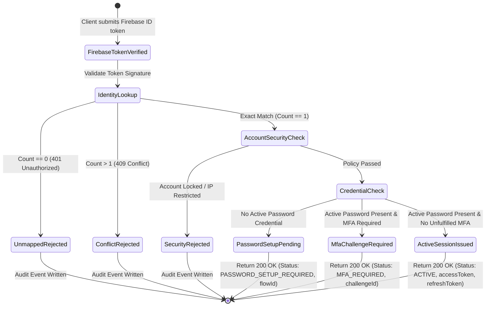

# Data Model & State Transitions: Firebase SSO Login & External Identity Mapping

## 1. Entities & Schema Contracts

### ExternalIdentity Entity (`external_identities`)

| Column Name | Type | Constraints | Description |
| --- | --- | --- | --- |
| `id` | `uuid` | Primary Key, default `gen_random_uuid()` | Unique record identifier |
| `tenant_code` | `varchar(50)` | NOT NULL, Foreign Key -> `tenants(tenant_code)` | Tenant isolation boundary |
| `user_id` | `uuid` | NOT NULL, Foreign Key -> `users(id)` | Associated internal user ID |
| `provider` | `varchar(50)` | NOT NULL, e.g. `'firebase'` | Federated Identity Provider identifier |
| `provider_subject` | `varchar(255)` | NOT NULL | External Subject UID (e.g. Firebase UID) |
| `created_at` | `timestamptz` | NOT NULL, default `now()` | Timestamp created |
| `updated_at` | `timestamptz` | NOT NULL, default `now()` | Timestamp updated |

*Composite Unique Index*: `uq_external_identity_subject` ON `(tenant_code, provider, provider_subject)`.

---

### Security Event Outbox Entity (`auth_security_events_outbox`)

| Column Name | Type | Constraints | Description |
| --- | --- | --- | --- |
| `id` | `uuid` | Primary Key | Unique outbox event identifier |
| `tenant_code` | `varchar(50)` | NOT NULL | Tenant identifier |
| `user_id` | `uuid` | NULLABLE | Internal user ID (null if unmapped) |
| `event_type` | `varchar(100)` | NOT NULL | e.g. `'SSO_LOGIN_SUCCEEDED'`, `'SSO_LOGIN_FAILED'` |
| `payload` | `jsonb` | NOT NULL | Sanitized event metadata (NO raw tokens/secrets) |
| `status` | `varchar(20)` | NOT NULL, default `'PENDING'` | Outbox status (`PENDING`, `DISPATCHED`, `FAILED`) |
| `created_at` | `timestamptz` | NOT NULL, default `now()` | Transaction write timestamp |

---

## 2. Redis Key Models & State Transitions

### Key Schemas

1. **Active HRMS Session**:
   - Key: `auth:session:{sessionId}` (Hash)
   - TTL: 15m sliding / 30d absolute
   - Fields: `userId`, `tenantCode`, `authState: 'ACTIVE'`, `ip`, `userAgent`

2. **Restricted SSO Password Setup Session**:
   - Key: `auth:sso-setup:{flowId}` (Hash)
   - TTL: 15 minutes
   - Fields: `userId`, `tenantCode`, `authState: 'sso-setup-pending'`, `provider: 'firebase'`

3. **Restricted MFA Challenge Session**:
   - Key: `auth:mfa-challenge:{challengeId}` (Hash)
   - TTL: 5 minutes
   - Fields: `userId`, `tenantCode`, `authState: 'mfa-challenge'`, `mfaMethods`

4. **Lockout Failure Counter**:
   - Key: `auth:login-failure:{tenantCode}:{userId}` (String counter)
   - TTL: 15 minutes

---

## 3. Session State Transition Flow

