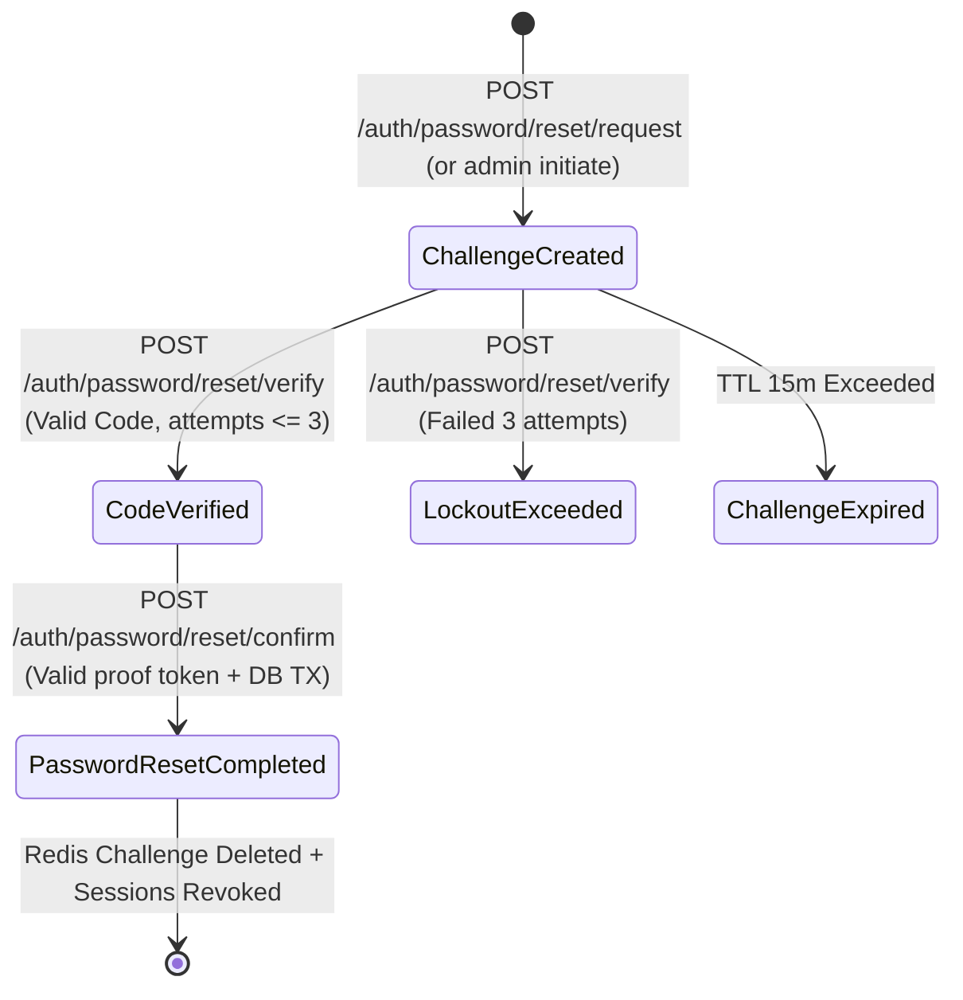

# Data Model & Schema Design: Password Reset Workflow

## Database Entities & Changes

### 1. `auth_security_events_outbox` Table Addition

Migration: `1722500000000-AddOutboxRetryColumns.ts`

| Column Name | Type | Nullable | Default | Description |
|---|---|---|---|---|
| `attempt_count` | `INTEGER` | NO | `0` | Number of relay delivery attempts |
| `last_attempted_at` | `TIMESTAMPTZ` | YES | `NULL` | Timestamp of the last relay delivery attempt |

### 2. `users` Table Updates

| Field | Operation | Description |
|---|---|---|
| `security_version` | `UPDATE` | Incremented by 1 (`security_version = security_version + 1`) upon password confirmation |

### 3. `credentials` Table Updates

| Field | Operation | Description |
|---|---|---|
| `status` | `UPDATE` | Existing active credential updated to `superseded` |
| New Row | `INSERT` | New row inserted with `password_hash` (Argon2id) and `status = 'active'` |

---

## Redis Cache Model

### Key: `auth:password-reset:{challengeId}`

- **Hash Tag**: `{tenantCode:userId}`
- **Data Type**: Hash
- **TTL**: 900 seconds (15 minutes)

#### Fields

| Field Name | Type | Description |
|---|---|---|
| `tenantCode` | String | Code of the tenant organization |
| `userId` | String | UUID of the user account |
| `hashedCode` | String | HMAC-SHA256 hash of the 6-digit OTP code |
| `codeVerified` | String | `"true"` or `"false"` |
| `resetToken` | String | UUID proof token issued upon successful verification |
| `attempts` | Number | Counter of failed verification attempts (Max 3) |

---

## State Transition Diagram

