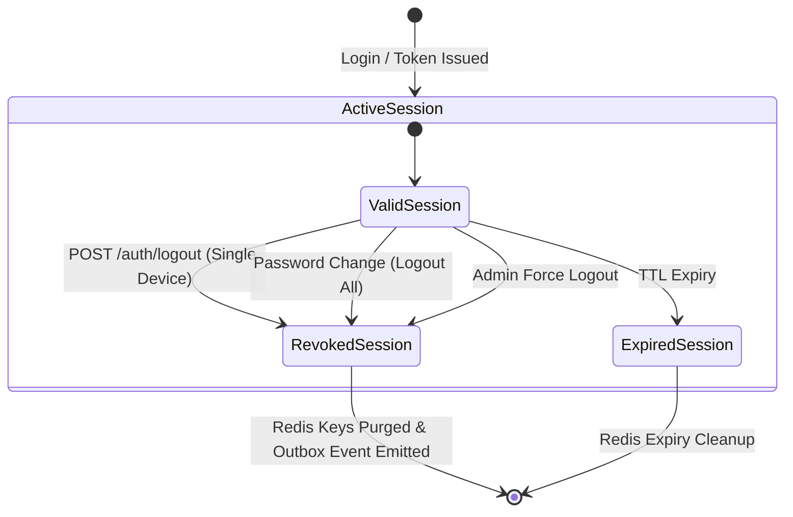

# Data Model: Session Management & Logout Engine

**Feature Branch**: `011-session-management` | **Date**: 2026-08-04

## 1. Entities & Schema Specifications

### PostgreSQL Entity: `User` (`users` table)

| Column | Type | Constraints | Description |
|---|---|---|---|
| `id` | `UUID` | Primary Key, `gen_random_uuid()` | Unique user identifier |
| `tenant_code` | `VARCHAR(64)` | NOT NULL, Composite Key component | Multi-tenant scope identifier |
| `security_version` | `INTEGER` | NOT NULL, Default `1` | Incrementing version used to invalidate JWT tokens globally |
| `status` | `VARCHAR(32)` | NOT NULL, Default `'active'` | Account state (`active`, `suspended`, `locked`) |
| `updated_at` | `TIMESTAMPTZ` | NOT NULL, `NOW()` | Timestamp of last modification |

```sql
-- Security Version Bump Query
UPDATE users 
SET security_version = security_version + 1,
    updated_at = NOW()
WHERE tenant_code = $1 
  AND id = $2 
  AND status = 'active';
```

---

### PostgreSQL Entity: `SecurityEventOutbox` (`auth_security_events_outbox` table)

| Column | Type | Constraints | Description |
|---|---|---|---|
| `id` | `UUID` | Primary Key, `gen_random_uuid()` | Unique event ID (deduplication key) |
| `tenant_code` | `VARCHAR(64)` | NOT NULL | Tenant scope identifier |
| `user_id` | `UUID` | NOT NULL | Target user ID |
| `event_type` | `VARCHAR(128)` | NOT NULL | Type of security event (`authentication.session-revoked`, `authentication.sessions-revoked`) |
| `event_version` | `INTEGER` | NOT NULL, Default `1` | Schema version of the event |
| `sanitized_payload` | `JSONB` | NOT NULL | Secret-free audit payload |
| `publish_status` | `VARCHAR(32)` | NOT NULL, Default `'pending'` | Status (`pending`, `published`, `failed`) |
| `created_at` | `TIMESTAMPTZ` | NOT NULL, `NOW()` | Creation timestamp |

```sql
-- Outbox Record Insertion
INSERT INTO auth_security_events_outbox (
  id, tenant_code, user_id, event_type, event_version, 
  sanitized_payload, publish_status, created_at
) VALUES (
  gen_random_uuid(), $1, $2, $3, $4, 
  $5::jsonb, 'pending', NOW()
);
```

---

## 2. Session Store Schema (Redis)

### Single Session Hash: `auth:session:{sessionId}`

- **Type**: Hash
- **Key Pattern**: `auth:session:{sessionId}`
- **TTL**: Dynamic (e.g., 86,400s / 24 hours)
- **Fields**:
  - `sessionId`: String (UUID)
  - `userId`: String (UUID)
  - `tenantCode`: String
  - `createdAt`: ISO 8601 Timestamp
  - `lastAccessAt`: ISO 8601 Timestamp
  - `sourceIp`: String
  - `userAgent`: String

### User Sessions Set Index: `auth:user-sessions:{tenantCode}:{userId}`

- **Type**: Set
- **Key Pattern**: `auth:user-sessions:{tenantCode}:{userId}` (Uses hash tag `{tenantCode:userId}` for cluster slot alignment)
- **Members**: Array of active `sessionId` strings.

---

## 3. Atomic Session Deletion Operations (Lua Scripts)

### Script 1: Single Session Revocation

```lua
-- KEYS[1]: auth:session:{sessionId}
-- KEYS[2]: auth:user-sessions:{tenantCode}:{userId}
-- ARGV[1]: sessionId

redis.call("DEL", KEYS[1])
redis.call("SREM", KEYS[2], ARGV[1])
return 1
```

### Script 2: Full User Session Purge

```lua
-- KEYS[1]: auth:user-sessions:{tenantCode}:{userId}

local sessions = redis.call("SMEMBERS", KEYS[1])
for _, sid in ipairs(sessions) do
    redis.call("DEL", "auth:session:" .. sid)
end
redis.call("DEL", KEYS[1])
return #sessions
```

---

## 4. State Transition Diagram


