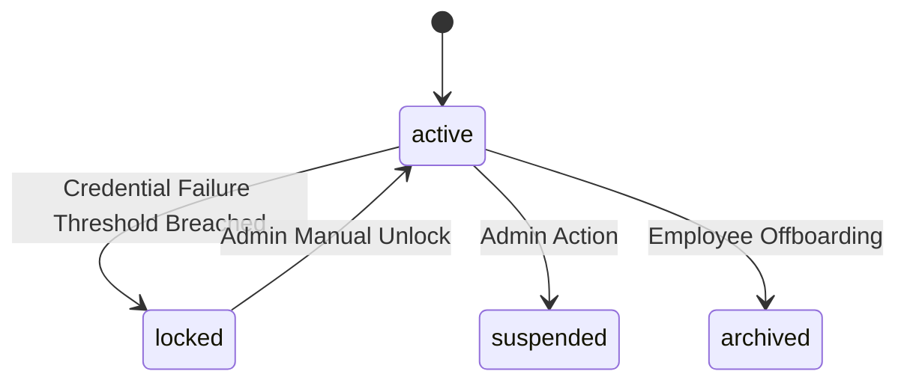

# Data Model: Account Lockout & Protection Mechanism

## Core Entities & States

### 1. User Entity (`users` table)
- **`id`**: `uuid` (Primary Key)
- **`tenant_code`**: `varchar` (Partition key for multi-tenancy)
- **`credential_status`**: `varchar` (Enum: `'active'`, `'locked'`, `'suspended'`, `'archived'`)
- **`security_version`**: `integer` (Default: `1`, incremented on lockout to invalidate JWT/sessions)
- **`updated_at`**: `timestamptz`



### 2. Authentication Settings (`authentication_settings` table)
- **`tenant_code`**: `varchar` (Primary Key)
- **`lockout_enabled`**: `boolean` (Default: `true`)
- **`lockout_threshold`**: `integer` (Default: `5`)

### 3. Auth Security Events Outbox (`auth_security_events_outbox` table)
- **`id`**: `uuid` (Primary Key)
- **`tenant_code`**: `varchar`
- **`user_id`**: `uuid`
- **`event_type`**: `varchar` (`'authentication.account-locked'`, `'authentication.sessions-revoked'`, `'authentication.security-alert-requested'`)
- **`sanitized_payload`**: `jsonb`
- **`publish_status`**: `varchar` (`'pending'`, `'published'`, `'failed'`)
- **`created_at`**: `timestamptz`

---

## Redis Key Schemas & Data Types

### 1. Credential Failure Counter
- **Key Pattern**: `auth:login-failure:{tenantCode}:{userId}`
- **Type**: String (Integer)
- **TTL**: 900 seconds (15 minutes)
- **Lua Script Increment**:
  ```lua
  local current = redis.call('INCR', KEYS[1])
  if tonumber(current) == 1 then
    redis.call('EXPIRE', KEYS[1], ARGV[1])
  end
  return current
  ```

### 2. IP Restriction Failure Counter
- **Key Pattern**: `auth:ip-failure:{tenantCode}:{userId}`
- **Type**: String (Integer)
- **TTL**: 900 seconds (15 minutes)
- **Lua Script Increment**: Atomic INCR with 900s TTL.
