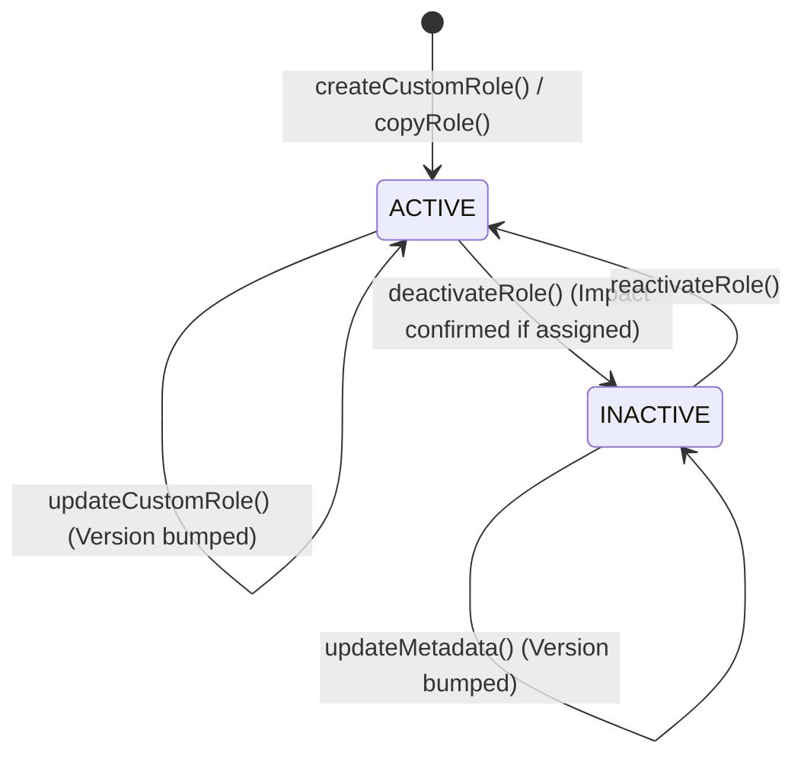

# Data Model: Custom Role Lifecycle Management

## 1. Entities and Tables

### 1.1 `roles` (Table: `roles`)
Represents both System Roles and Custom Roles within a tenant context.

| Column | Type | Nullable | Default | Description |
|---|---|---|---|---|
| `id` | `UUID` | No | `uuid_generate_v4()` | Primary Key |
| `tenant_code` | `VARCHAR(100)` | No | - | Owning tenant identifier (Multi-tenant partition) |
| `name` | `VARCHAR(150)` | No | - | Unique role display name within tenant |
| `description` | `TEXT` | Yes | `NULL` | Optional administrative description |
| `role_type` | `VARCHAR(20)` | No | - | Enum: `SYSTEM` or `CUSTOM` |
| `status` | `VARCHAR(20)` | No | `'ACTIVE'` | Enum: `ACTIVE` or `INACTIVE` |
| `system_role_key` | `VARCHAR(100)` | Yes | `NULL` | Enum: `ADMINISTRATOR`, `MANAGER`, `EMPLOYEE` (null for custom roles) |
| `version` | `INTEGER` | No | `1` | Optimistic concurrency version counter |
| `created_by` | `UUID` | Yes | `NULL` | User ID of creator |
| `updated_by` | `UUID` | Yes | `NULL` | User ID of last modifier |
| `created_at` | `TIMESTAMPTZ` | No | `NOW()` | Creation timestamp |
| `updated_at` | `TIMESTAMPTZ` | No | `NOW()` | Modification timestamp |

**Indexes & Constraints**:
- Unique: `uq_roles_tenant_name` (`tenant_code`, `name`)
- Unique: `uq_roles_tenant_id` (`tenant_code`, `id`)
- Index: `idx_roles_tenant_type_status` (`tenant_code`, `role_type`, `status`)

---

### 1.2 `role_permissions` (Table: `role_permissions`)
Junction mapping permissions granted to a role.

| Column | Type | Nullable | Default | Description |
|---|---|---|---|---|
| `id` | `UUID` | No | `uuid_generate_v4()` | Primary Key |
| `tenant_code` | `VARCHAR(100)` | No | - | Owning tenant identifier |
| `role_id` | `UUID` | No | - | Foreign Key to `roles(id)` |
| `permission_code` | `VARCHAR(150)` | No | - | Permission code from catalog (e.g. `employee.view`) |
| `is_protected` | `BOOLEAN` | No | `FALSE` | Inviolable lock flag (always `FALSE` for custom roles) |
| `created_at` | `TIMESTAMPTZ` | No | `NOW()` | Creation timestamp |
| `updated_at` | `TIMESTAMPTZ` | No | `NOW()` | Modification timestamp |

**Indexes & Constraints**:
- Unique: `uq_role_permissions_role_perm` (`role_id`, `permission_code`)
- Index: `idx_role_permissions_role_id` (`role_id`)
- Foreign Key: `role_id` -> `roles(id)` with `ON DELETE CASCADE`

---

### 1.3 Associated Projection Tables (Read Only in this Domain)

#### `user_group_roles`
Maps roles to user groups for dynamic capability assignment.
- Used to compute `is_unassigned: boolean = (COUNT(user_group_id) == 0)` and `assigned_user_group_count`.

#### `user_effective_roles`
Materialized projection of effective role assignments per user.
- Used to query `active_user_reach_count = COUNT(DISTINCT user_id) WHERE role_id = :roleId`.

---

### 1.4 `auth_security_events_outbox` (Table: `auth_security_events_outbox`)
Transactional outbox table for reliable security audit publishing.

| Event Type | Payload Attributes | Trigger Condition |
|---|---|---|
| `role.created` | `roleId`, `name`, `type: 'CUSTOM'`, `permissionCodes` | Custom role created |
| `role.copied` | `newRoleId`, `sourceRoleId`, `name`, `permissionCodes` | Role cloned |
| `role.updated` | `roleId`, `name`, `description`, `addedPermissions`, `removedPermissions`, `version` | Role details or permissions updated |
| `role.deactivated` | `roleId`, `name`, `affectedUserGroupCount`, `affectedUserCount` | Role transitioned to `INACTIVE` |
| `role.reactivated` | `roleId`, `name` | Role transitioned to `ACTIVE` |

---

## 2. State Lifecycle Transitions



## 3. Cache Model (Redis)

- **Key**: `authz:role:{tenant}:{roleId}`
- **TTL**: 86400 seconds (1 day) with synchronous invalidation/overwrite on mutation
- **Schema**:
```json
{
  "roleId": "3fa85f64-5717-4562-b3fc-2c963f66afa6",
  "tenantCode": "tenant-001",
  "status": "ACTIVE",
  "version": 3,
  "permissions": [
    "employee.view",
    "employee.update"
  ]
}
```
*(When status is `INACTIVE`, permissions array is empty or status check fails closed in authorization guard).*
