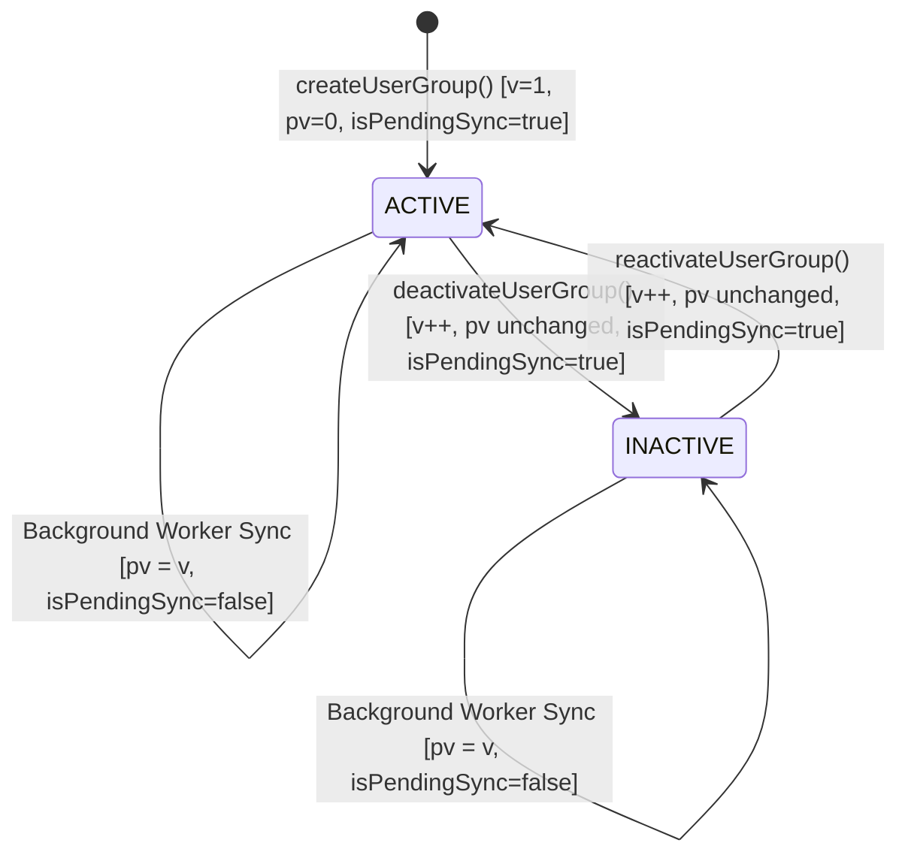

# Data Model: User Group Definition & Lifecycle

## 1. Entities and Database Tables

### 1.1 `user_groups` (Table: `user_groups`)
Represents a dynamic population rule and scope definition within a tenant.

| Column | Type | Nullable | Default | Description |
|---|---|---|---|---|
| `id` | `UUID` | No | `uuid_generate_v4()` | Primary Key |
| `tenant_code` | `VARCHAR(100)` | No | - | Owning tenant identifier (Multi-tenant partition) |
| `name` | `VARCHAR(150)` | No | - | Unique group display name within tenant |
| `description` | `TEXT` | Yes | `NULL` | Optional administrative description |
| `status` | `VARCHAR(20)` | No | `'ACTIVE'` | Enum: `ACTIVE` or `INACTIVE` |
| `scope_type` | `VARCHAR(50)` | No | - | Enum: `SELF`, `DIRECT_REPORTEES`, `COMPANY`, `LOCATION`, `DEPARTMENT`, `TENANT_WIDE` |
| `scope_ref_id` | `VARCHAR(100)` | Yes | `NULL` | Optional anchor ID for specific company, location, or department |
| `matching_rule` | `JSONB` | No | - | JSON structured rule definition (closed allow-list) |
| `rule_attribute_keys` | `TEXT[]` | No | - | Extracted distinct attribute keys used in rule (e.g. `['employmentStatus', 'departmentId']`) |
| `version` | `INTEGER` | No | `1` | Mutation and optimistic concurrency version counter |
| `projection_version` | `INTEGER` | No | `0` | Version counter of last completed membership projection sync |
| `created_by` | `UUID` | Yes | `NULL` | User ID of creator |
| `updated_by` | `UUID` | Yes | `NULL` | User ID of last modifier |
| `created_at` | `TIMESTAMPTZ` | No | `NOW()` | Creation timestamp |
| `updated_at` | `TIMESTAMPTZ` | No | `NOW()` | Modification timestamp |

**Indexes & Constraints**:
- Unique: `uq_user_groups_tenant_name` (`tenant_code`, `name`)
- Unique: `uq_user_groups_tenant_id` (`tenant_code`, `id`)
- Index: `idx_user_groups_tenant_status` (`tenant_code`, `status`)
- Index: `idx_user_groups_rule_attr_keys` USING GIN (`rule_attribute_keys`)

---

### 1.2 `user_group_roles` (Table: `user_group_roles`)
Junction mapping roles assigned to a User Group.

| Column | Type | Nullable | Default | Description |
|---|---|---|---|---|
| `id` | `UUID` | No | `uuid_generate_v4()` | Primary Key |
| `tenant_code` | `VARCHAR(100)` | No | - | Owning tenant identifier |
| `user_group_id` | `UUID` | No | - | Foreign Key to `user_groups(id)` ON DELETE CASCADE |
| `role_id` | `UUID` | No | - | Foreign Key to `roles(id)` ON DELETE RESTRICT |
| `created_at` | `TIMESTAMPTZ` | No | `NOW()` | Creation timestamp |

**Indexes & Constraints**:
- Unique: `uq_user_group_roles_tenant_group_role` (`tenant_code`, `user_group_id`, `role_id`)
- Index: `idx_user_group_roles_user_group_id` (`user_group_id`)
- Index: `idx_user_group_roles_role_id` (`role_id`)

---

### 1.3 `auth_security_events_outbox` (Table: `auth_security_events_outbox`)
Transactional outbox records emitted for audit logging and downstream worker notification.

| Event Type | Payload Attributes | Trigger Condition |
|---|---|---|
| `user_group.created` | `userGroupId`, `name`, `scopeType`, `roleIds`, `version`, `status` | User group created |
| `user_group.updated` | `userGroupId`, `name`, `scopeType`, `addedRoleIds`, `removedRoleIds`, `version` | User group modified |
| `user_group.deactivated` | `userGroupId`, `name`, `version`, `status: 'INACTIVE'` | User group transitioned to `INACTIVE` |
| `user_group.reactivated` | `userGroupId`, `name`, `version`, `status: 'ACTIVE'` | User group transitioned to `ACTIVE` |
| `authorization.user-group-updated` | `tenantCode`, `userGroupId`, `version`, `ruleAttributeKeys`, `timestamp` | Any lifecycle or configuration mutation |

---

## 2. Dynamic Matching Rule Grammar

```json
{
  "clauses": [
    {
      "attribute": "employmentStatus",
      "operator": "EQUALS",
      "value": "ACTIVE"
    },
    {
      "attribute": "departmentId",
      "operator": "IN",
      "values": ["dept-eng-01", "dept-eng-02"]
    }
  ]
}
```

**Allow-list Attributes**:
- `employmentStatus` (String: `ACTIVE`, `PROBATION`, `NOTICE_PERIOD`, `TERMINATED`, `SUSPENDED`)
- `companyId` (UUID/String)
- `locationId` (UUID/String)
- `departmentId` (UUID/String)
- `gradeId` (UUID/String)
- `jobTitleId` (UUID/String)
- `reporteesCount` (Integer)
- `hasReportees` (Boolean)

---

## 3. State Lifecycle and Dirty-State Tracking


