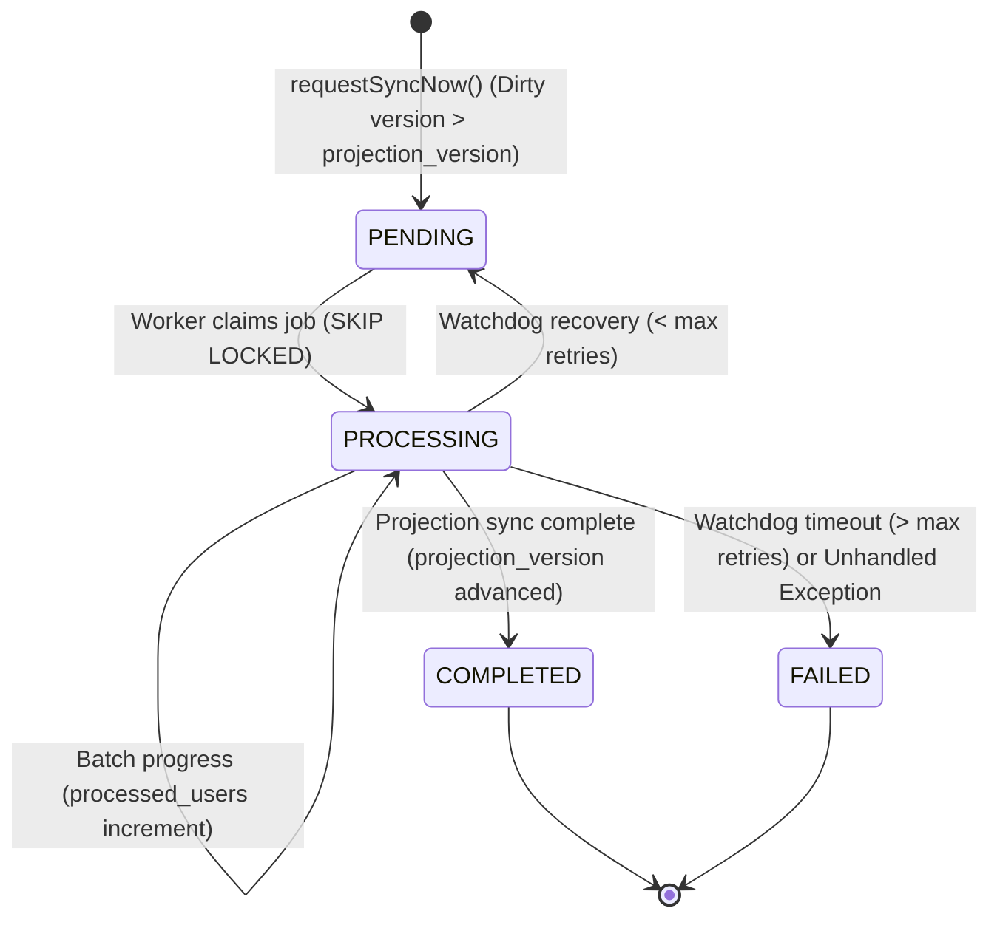

# Data Model: Authorization Sync Now

**Feature**: `025-authorization-sync-now`
**Status**: Completed

## 1. Entities & Tables

### Entity: `AuthorizationSyncJob` (`authorization_sync_jobs`)

Represents an individual on-demand or scheduled authorization reconciliation task.

| Column | Type | Nullable | Default | Description |
|---|---|---|---|---|
| `id` | `UUID` | No | `uuid_generate_v4()` | Primary Key |
| `tenant_code` | `VARCHAR(64)` | No | — | Tenant identifier |
| `source_type` | `VARCHAR(32)` | No | — | `USER_GROUP` \| `ROLE` |
| `source_id` | `UUID` | No | — | Target entity ID |
| `source_version` | `INT` | No | — | Entity configuration version being synchronized |
| `trigger_type` | `VARCHAR(32)` | No | `MANUAL` | `MANUAL` \| `SCHEDULED` \| `SYSTEM` |
| `status` | `VARCHAR(32)` | No | `PENDING` | `PENDING` \| `PROCESSING` \| `COMPLETED` \| `FAILED` |
| `total_users` | `INT` | Yes | `NULL` | Total affected users count |
| `processed_users`| `INT` | No | `0` | Count of processed users so far |
| `retry_count` | `INT` | No | `0` | Number of watchdog recovery attempts |
| `error_details` | `JSONB` | Yes | `NULL` | Structured error logs and diagnostic info |
| `started_at` | `TIMESTAMPTZ` | Yes | `NULL` | Timestamp worker began processing |
| `completed_at` | `TIMESTAMPTZ` | Yes | `NULL` | Timestamp job finished (completed or failed) |
| `created_by` | `VARCHAR(128)` | Yes | `NULL` | User/Actor ID who triggered sync |
| `created_at` | `TIMESTAMPTZ` | No | `NOW()` | Audit creation timestamp |
| `updated_at` | `TIMESTAMPTZ` | No | `NOW()` | Last modified timestamp |

### Indexes & Constraints

1. **In-Flight Dedup Partial Unique Index**:
   ```sql
   CREATE UNIQUE INDEX uq_authz_sync_jobs_in_flight 
   ON authorization_sync_jobs (tenant_code, source_type, source_id, source_version) 
   WHERE status IN ('PENDING', 'PROCESSING');
   ```
2. **Worker Polling Index**:
   ```sql
   CREATE INDEX idx_authz_sync_jobs_poll 
   ON authorization_sync_jobs (status, created_at)
   WHERE status = 'PENDING';
   ```
3. **Watchdog Reclaim Index**:
   ```sql
   CREATE INDEX idx_authz_sync_jobs_watchdog 
   ON authorization_sync_jobs (status, updated_at) 
   WHERE status = 'PROCESSING';
   ```
4. **Tenant Scoped History Index**:
   ```sql
   CREATE INDEX idx_authz_sync_jobs_tenant_history 
   ON authorization_sync_jobs (tenant_code, source_type, source_id, created_at DESC);
   ```

---

## 2. State Lifecycle Transitions



---

## 3. Related Existing Entities

- **`UserGroup` (`user_groups`)**:
  - `version`: Integer (increments on rule/role change).
  - `projection_version`: Integer (updated to match `source_version` when sync finishes).
- **`Role` (`roles`)**:
  - `version`: Integer.
  - `projection_version`: Integer.
- **`UserGroupMembership` (`user_group_memberships`)**:
  - Materialized matching relationships `(tenant_code, group_id, employee_id)`.
- **`UserEffectiveRole` (`user_effective_roles`)**:
  - Materialized user role projections `(tenant_code, employee_id, role_id, source_group_id, scope)`.
- **`AuthSecurityEventOutbox` (`auth_security_events_outbox`)**:
  - Transactional outbox table capturing outbox events for Kafka publishing.
